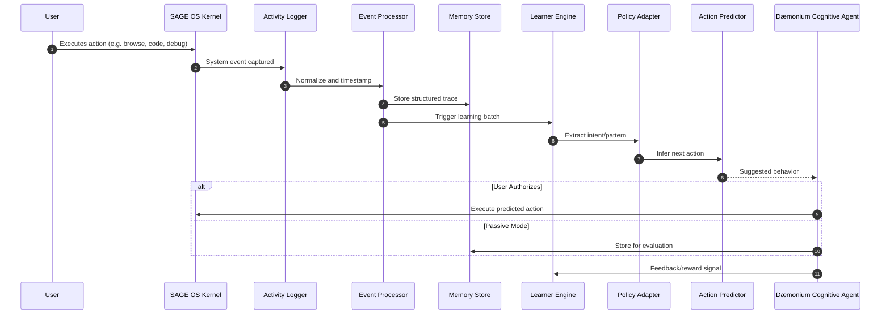

<!--
─────────────────────────────────────────────────────────────────────────────
SAGE OS — Copyright (c) 2025 Ashish Vasant Yesale (ashishyesale007@gmail.com)
SPDX-License-Identifier: BSD-3-Clause OR Proprietary
SAGE OS is dual-licensed under the BSD 3-Clause License and a Commercial License.

This file is part of the SAGE OS Project.
─────────────────────────────────────────────────────────────────────────────
-->
 
---
 
# 🧠 Dæmonium Cognitive Agent Pipeline

**Dæmonium Cognitive** is a personalized, self-evolving AI agent built into SAGE OS. It passively observes the user's digital behavior, learns from real-world problem-solving patterns, and evolves to act autonomously in future contexts—mimicking the user's thinking process.

---

## 🎯 Goals

- Learn from real-time digital activity (web, apps, files, system usage).
- Adapt to user's personal decision-making strategies over time.
- Perform passive behavioral modeling with local training.
- Use self-supervised or reinforcement learning to evolve.
- Become a cognitive extension of the user inside SAGE OS.

---

## 🔁 Cognitive Agent Pipeline (Overview)

The pipeline is designed to continuously monitor, learn, and refine the model in the background.

### 🧩 Major Components

| Component               | Description |
|-------------------------|-------------|
| `Activity Logger`       | Monitors app usage, shell commands, file access, web queries. |
| `Event Processor`       | Normalizes and time-stamps all events. |
| `Memory Store`          | Stores short-term and long-term digital memory snapshots. |
| `Learner Engine`        | Trains a personalized LLM using passive/self-supervised learning. |
| `Policy Adapter`        | Extracts intent or strategies from behavior. |
| `Action Predictor`      | Predicts next likely step in user’s task. |
| `Cognitive Agent`       | Acts on behalf of the user when authorized. |
| `Self-Evaluator`        | Uses reward signals or logs to reinforce useful patterns. |

---

## 🔄 Sequence Diagram: Cognitive Agent Pipeline

---

## 🛠️ Tech Stack

| Layer               | Tools & Frameworks                                |
| ------------------- | ------------------------------------------------- |
| Activity Logging    | `eBPF`, `auditd`, `inotify`, `ptrace`             |
| Data Structuring    | Custom `C`/`Rust` event processor                 |
| LLM Personalization | `LoRA`, `QLoRA`, `PEFT`, `BGE`, `OpenHermes`      |
| Learning Algorithms | Self-supervised + RLHF (local)                    |
| Memory Store        | `SQLite` / Embedded `Vector DB`                   |
| Action Prediction   | `Transformer`-based or `ReAct`-style reasoning    |
| Agent Core Runtime  | `C/Rust` integrated daemon + PyTorch/ONNX backend |

---

## 🔐 Privacy & Control

* 🧠 All learning is local by default.
* 🔒 No outbound data collection or cloud upload.
* ✅ User approves agent actions before execution (configurable).

---

## 🔄 Future Extensions

* Multi-modal input (speech, biometrics).
* Multi-agent collaboration (team cognition).
* Cross-device behavior modeling.
* Cloud-assisted sync (optional with encryption).

---

## 📚 References

* [LoRA: Low-Rank Adaptation](https://arxiv.org/abs/2106.09685)
* [OpenHermes](https://huggingface.co/OpenHermes)
* [ReAct Prompting](https://arxiv.org/abs/2210.03629)
* [vLLM](https://github.com/vllm-project/vllm)
* [BGE Embeddings](https://huggingface.co/BAAI/bge-small-en)

---

> “Dæmonium Cognitive” is the soul of SAGE OS — a silent partner in your mind, learning how you think and acting when you're not around.

 
