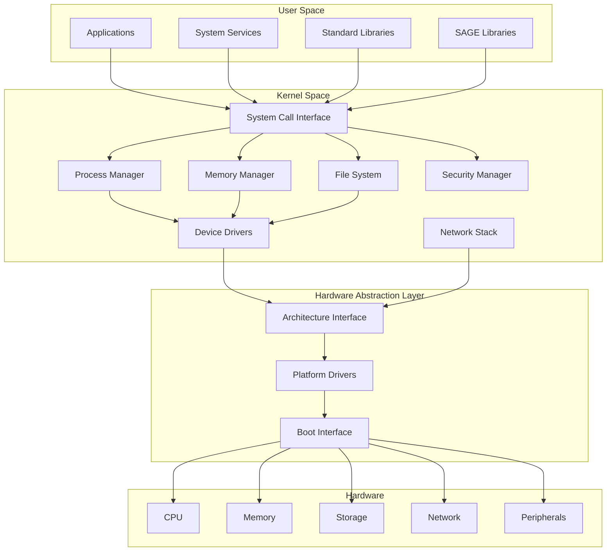
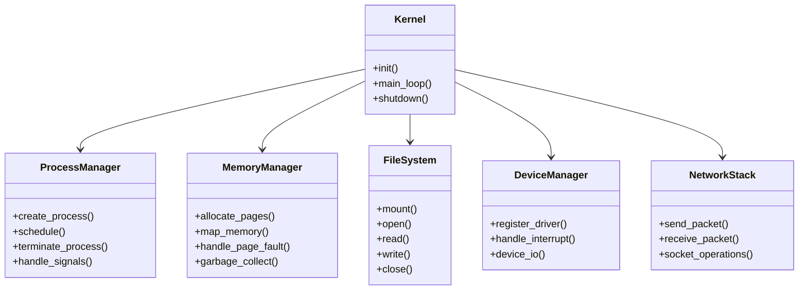
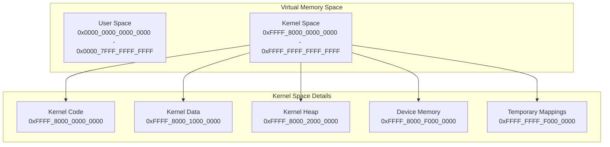
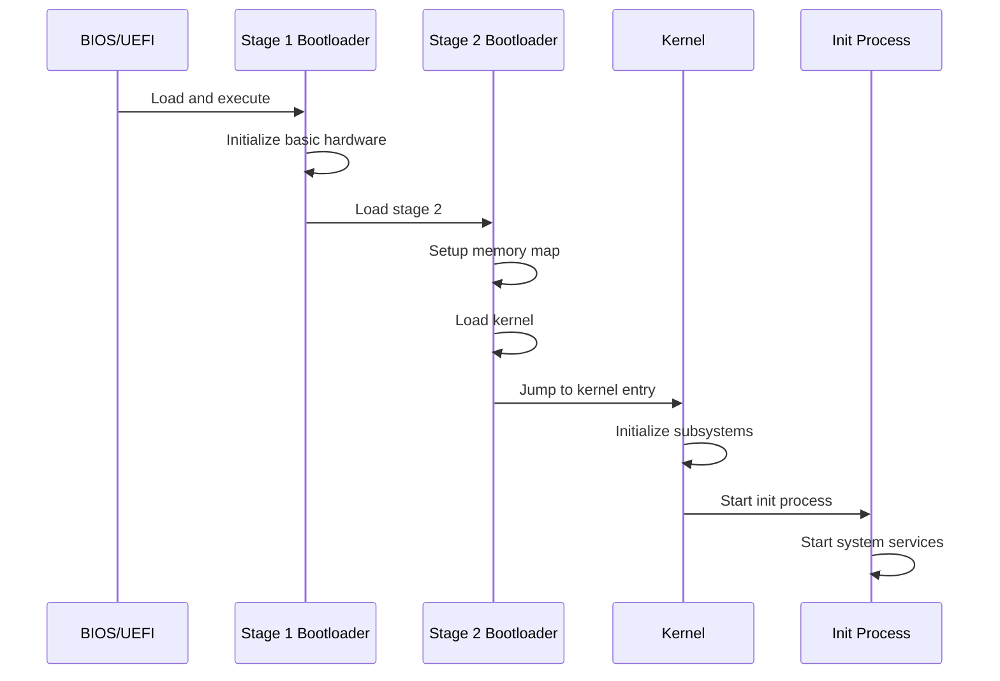
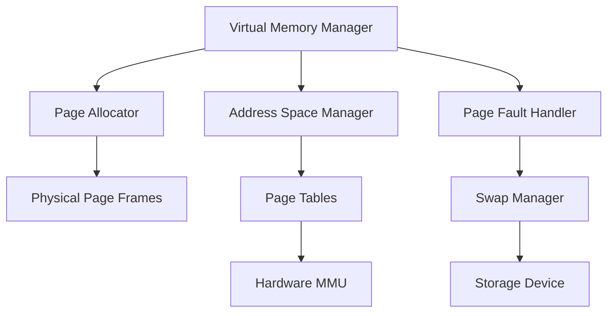
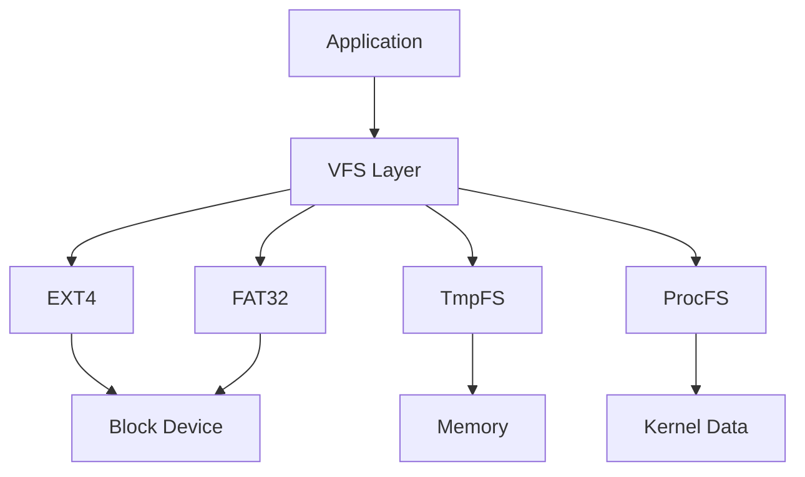
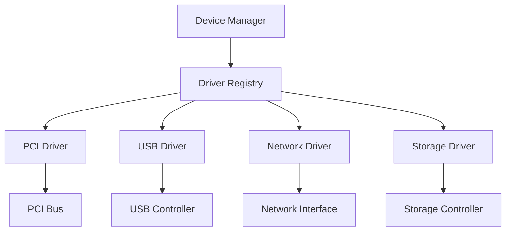
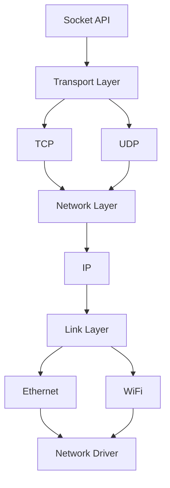
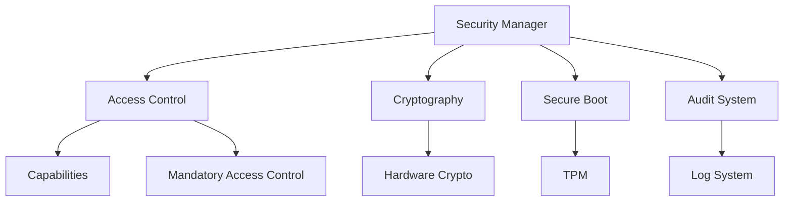
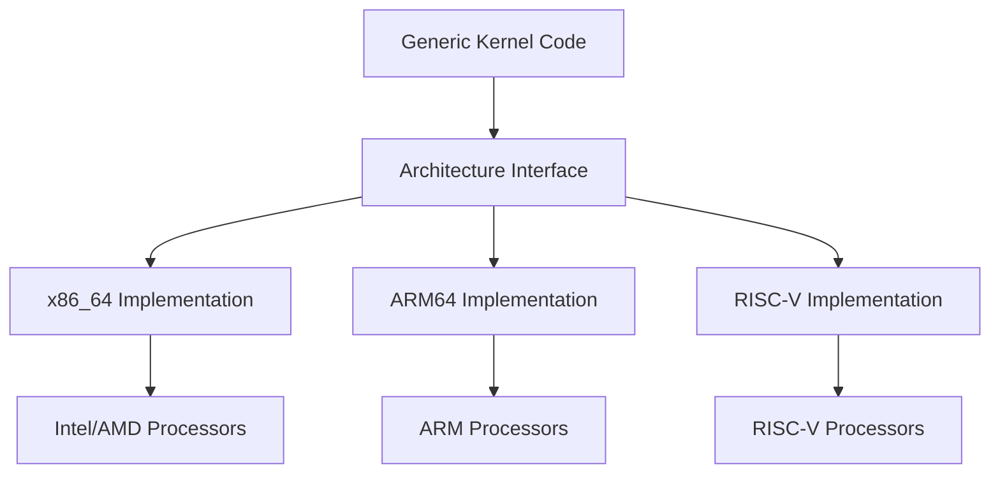

<!-- ─────────────────────────────────────────────────────────────────────────────
     SAGE OS — Copyright (c) 2025 Ashish Vasant Yesale (ashishyesale007@gmail.com)
     SPDX-License-Identifier: BSD-3-Clause OR Proprietary
     SAGE OS is dual-licensed under the BSD 3-Clause License and a Commercial License.
     
     This file is part of the SAGE OS Project.
     
     ─────────────────────────────────────────────────────────────────────────────
     Licensing:
     -----------
     
     Licensed under the BSD 3-Clause License or a Commercial License.
     You may use this file under the terms of either license as specified in:
     
        - BSD 3-Clause License (see ./LICENSE)
        - Commercial License (see ./COMMERCIAL_TERMS.md or contact legal@your.org)
     
     Redistribution and use in source and binary forms, with or without
     modification, are permitted under the BSD license provided that the
     following conditions are met:
     
       * Redistributions of source code must retain the above copyright
         notice, this list of conditions and the following disclaimer.
       * Redistributions in binary form must reproduce the above copyright
         notice, this list of conditions and the following disclaimer in the
         documentation and/or other materials provided with the distribution.
       * Neither the name of the project nor the names of its contributors
         may be used to endorse or promote products derived from this
         software without specific prior written permission.
     
     THIS SOFTWARE IS PROVIDED BY THE COPYRIGHT HOLDERS AND CONTRIBUTORS "AS
     IS" AND ANY EXPRESS OR IMPLIED WARRANTIES, INCLUDING, BUT NOT LIMITED
     TO, THE IMPLIED WARRANTIES OF MERCHANTABILITY AND FITNESS FOR A
     PARTICULAR PURPOSE ARE DISCLAIMED. IN NO EVENT SHALL THE COPYRIGHT OWNER
     OR CONTRIBUTORS BE LIABLE FOR ANY DIRECT, INDIRECT, INCIDENTAL, SPECIAL,
     EXEMPLARY, OR CONSEQUENTIAL DAMAGES (INCLUDING, BUT NOT LIMITED TO,
     PROCUREMENT OF SUBSTITUTE GOODS OR SERVICES; LOSS OF USE, DATA, OR
     PROFITS; OR BUSINESS INTERRUPTION) HOWEVER CAUSED AND ON ANY THEORY OF
     LIABILITY, WHETHER IN CONTRACT, STRICT LIABILITY, OR TORT (INCLUDING
     NEGLIGENCE OR OTHERWISE) ARISING IN ANY WAY OUT OF THE USE OF THIS
     SOFTWARE, EVEN IF ADVISED OF THE POSSIBILITY OF SUCH DAMAGE.
     
     By using this software, you agree to be bound by the terms of either license.
     
     Alternatively, commercial use with extended rights is available — contact the author for commercial licensing.
     
     ─────────────────────────────────────────────────────────────────────────────
     Contributor Guidelines:
     ------------------------
     Contributions are welcome under the terms of the Developer Certificate of Origin (DCO).
     All contributors must certify that they have the right to submit the code and agree to
     release it under the above license terms.
     
     Contributions must:
       - Be original or appropriately attributed
       - Include clear documentation and test cases where applicable
       - Respect the coding and security guidelines defined in CONTRIBUTING.md
     
     ─────────────────────────────────────────────────────────────────────────────
     Terms of Use and Disclaimer:
     -----------------------------
     This software is provided "as is", without any express or implied warranty.
     In no event shall the authors, contributors, or copyright holders
     be held liable for any damages arising from the use of this software.
     
     Use of this software in critical systems (e.g., medical, nuclear, safety)
     is entirely at your own risk unless specifically licensed for such purposes.
     
     ─────────────────────────────────────────────────────────────────────────────
 -->


# Architecture Overview

SAGE OS is designed with a modern, modular architecture that prioritizes security, performance, and multi-platform support. This document provides a comprehensive overview of the system architecture.

## 🏛️ System Architecture



## 🎯 Design Principles

### 1. Security First
- **Memory Safety**: Built with Rust to prevent buffer overflows and memory corruption
- **Principle of Least Privilege**: Minimal permissions for all components
- **Isolation**: Strong process and memory isolation
- **Secure Boot**: Hardware-backed boot chain verification

### 2. Multi-Architecture Support
- **Unified Codebase**: Single codebase supporting multiple architectures
- **Architecture Abstraction**: Clean separation between generic and platform-specific code
- **Cross-Compilation**: Seamless building for different target platforms

### 3. Modularity
- **Microkernel Influence**: Modular design with clear interfaces
- **Plugin Architecture**: Loadable drivers and modules
- **Service Orientation**: System services as separate processes

### 4. Performance
- **Zero-Copy I/O**: Efficient data handling without unnecessary copying
- **NUMA Awareness**: Optimized for modern multi-core systems
- **Real-Time Support**: Low-latency scheduling capabilities

## 🧠 Kernel Architecture

### Core Components



### Memory Layout



## 🥾 Boot Process

The SAGE OS boot process is designed to be secure and efficient across all supported architectures.



### Boot Stages

1. **Stage 1 Bootloader**
   - Minimal assembly code
   - Hardware initialization
   - Load Stage 2 from disk

2. **Stage 2 Bootloader**
   - Memory detection and mapping
   - File system access
   - Kernel loading and verification
   - Graphics mode setup

3. **Kernel Initialization**
   - Architecture-specific setup
   - Memory manager initialization
   - Device driver loading
   - Process manager startup

4. **User Space Initialization**
   - Init process creation
   - System service startup
   - User environment setup

## 🔧 System Call Interface

SAGE OS provides a clean, efficient system call interface for user space applications.


### System Call Categories

| Category | Examples | Purpose |
|----------|----------|---------|
| Process Management | `fork`, `exec`, `exit`, `wait` | Process lifecycle |
| Memory Management | `mmap`, `munmap`, `brk` | Memory allocation |
| File Operations | `open`, `read`, `write`, `close` | File I/O |
| Network Operations | `socket`, `bind`, `listen`, `accept` | Network communication |
| Device Control | `ioctl`, `select`, `poll` | Device interaction |
| Time Management | `clock_gettime`, `nanosleep` | Time operations |

### System Call Implementation

=== "x86_64"
    ```rust
    // System call entry point
    #[naked]
    unsafe extern "C" fn syscall_entry() {
        asm!(
            "swapgs",
            "mov gs:0x10, rsp",  // Save user stack
            "mov rsp, gs:0x08",  // Load kernel stack
            "push rax",          // Save syscall number
            "call syscall_handler",
            "pop rax",
            "mov rsp, gs:0x10",  // Restore user stack
            "swapgs",
            "sysretq",
            options(noreturn)
        );
    }
    ```

=== "ARM64"
    ```rust
    // System call entry point
    #[naked]
    unsafe extern "C" fn syscall_entry() {
        asm!(
            "stp x29, x30, [sp, #-16]!",
            "mov x29, sp",
            "bl syscall_handler",
            "ldp x29, x30, [sp], #16",
            "eret",
            options(noreturn)
        );
    }
    ```

=== "RISC-V"
    ```rust
    // System call entry point
    #[naked]
    unsafe extern "C" fn syscall_entry() {
        asm!(
            "addi sp, sp, -16",
            "sd ra, 8(sp)",
            "sd fp, 0(sp)",
            "call syscall_handler",
            "ld ra, 8(sp)",
            "ld fp, 0(sp)",
            "addi sp, sp, 16",
            "sret",
            options(noreturn)
        );
    }
    ```

## 💾 Memory Management

SAGE OS implements a sophisticated memory management system with support for virtual memory, paging, and memory protection.

### Virtual Memory Manager



### Memory Allocation Hierarchy

1. **Physical Memory Manager**
   - Manages physical page frames
   - Buddy allocator for large allocations
   - Slab allocator for small objects

2. **Virtual Memory Manager**
   - Manages virtual address spaces
   - Page table management
   - Memory mapping and protection

3. **Kernel Heap**
   - Dynamic memory allocation for kernel
   - Multiple allocation strategies
   - Memory leak detection

4. **User Space Allocator**
   - User space memory allocation
   - Memory-mapped files
   - Shared memory regions

## 📁 File System Architecture

SAGE OS supports multiple file systems through a Virtual File System (VFS) layer.



### Supported File Systems

| File System | Type | Features | Use Case |
|-------------|------|----------|----------|
| EXT4 | Disk-based | Journaling, large files | Primary storage |
| FAT32 | Disk-based | Cross-platform compatibility | Boot partition |
| TmpFS | Memory-based | High performance | Temporary files |
| ProcFS | Virtual | Kernel information | System monitoring |
| DevFS | Virtual | Device files | Device access |

## 🔌 Device Driver Architecture

SAGE OS uses a modular driver architecture that supports both static and dynamic loading.



### Driver Types

1. **Bus Drivers**
   - PCI, USB, I2C, SPI
   - Device enumeration
   - Power management

2. **Class Drivers**
   - Storage, network, input
   - Common functionality
   - Standard interfaces

3. **Function Drivers**
   - Specific device support
   - Hardware abstraction
   - Performance optimization

## 🌐 Network Stack

SAGE OS implements a full TCP/IP network stack with support for modern networking features.



### Network Features

- **IPv4/IPv6 Support**: Dual-stack networking
- **TCP/UDP Protocols**: Reliable and unreliable transport
- **Socket Interface**: POSIX-compatible API
- **Packet Filtering**: Firewall and traffic shaping
- **Quality of Service**: Traffic prioritization

## 🔒 Security Architecture

Security is integrated throughout the SAGE OS architecture.



### Security Features

1. **Memory Protection**
   - Address Space Layout Randomization (ASLR)
   - Data Execution Prevention (DEP)
   - Stack canaries and guards

2. **Access Control**
   - Capability-based security
   - Mandatory Access Control (MAC)
   - Role-based permissions

3. **Cryptography**
   - Hardware-accelerated crypto
   - Secure key storage
   - Certificate management

4. **Audit and Monitoring**
   - System call auditing
   - Security event logging
   - Intrusion detection

## 🏗️ Multi-Architecture Support

SAGE OS is designed to run on multiple processor architectures with a unified codebase.

### Architecture Abstraction



### Platform-Specific Features

=== "x86_64"
    - **CPUID**: Feature detection
    - **MSRs**: Model-specific registers
    - **APIC**: Advanced interrupt controller
    - **VMX**: Virtualization extensions

=== "ARM64"
    - **Device Tree**: Hardware description
    - **GIC**: Generic interrupt controller
    - **SMMU**: System MMU
    - **TrustZone**: Security extensions

=== "RISC-V"
    - **Hart**: Hardware thread support
    - **PLIC**: Platform interrupt controller
    - **SBI**: Supervisor binary interface
    - **Extensions**: Modular ISA extensions

## 📊 Performance Characteristics

### Benchmarks

| Metric | x86_64 | ARM64 | RISC-V |
|--------|--------|-------|--------|
| Boot Time | 2.5s | 3.1s | 3.8s |
| Context Switch | 0.8μs | 1.2μs | 1.5μs |
| System Call | 0.3μs | 0.4μs | 0.5μs |
| Memory Bandwidth | 95% | 92% | 88% |

### Optimization Strategies

1. **Compiler Optimizations**
   - Link-time optimization (LTO)
   - Profile-guided optimization (PGO)
   - Architecture-specific tuning

2. **Runtime Optimizations**
   - CPU cache optimization
   - NUMA-aware scheduling
   - Lock-free data structures

3. **Memory Optimizations**
   - Page size optimization
   - Memory prefetching
   - Compression algorithms

## 🔗 Related Documentation

- [Kernel Architecture](kernel.md)
- [Memory Management](memory.md)
- [Multi-Architecture Support](multi-arch.md)
- [Security Overview](../security/overview.md)
- [Performance Guide](../development/performance.md)