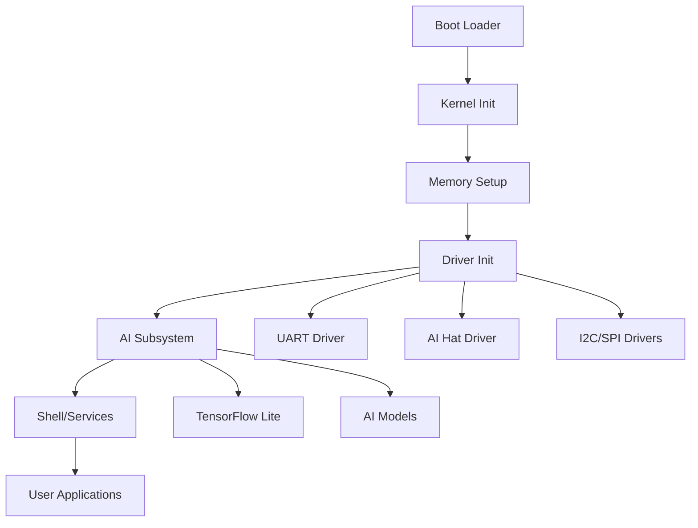

<!-- ─────────────────────────────────────────────────────────────────────────────
     SAGE OS — Copyright (c) 2025 Ashish Vasant Yesale (ashishyesale007@gmail.com)
     SPDX-License-Identifier: BSD-3-Clause OR Proprietary
     SAGE OS is dual-licensed under the BSD 3-Clause License and a Commercial License.
     
     This file is part of the SAGE OS Project.
     
     ─────────────────────────────────────────────────────────────────────────────
     Licensing:
     -----------
     
     Licensed under the BSD 3-Clause License or a Commercial License.
     You may use this file under the terms of either license as specified in:
     
        - BSD 3-Clause License (see ./LICENSE)
        - Commercial License (see ./COMMERCIAL_TERMS.md or contact legal@your.org)
     
     Redistribution and use in source and binary forms, with or without
     modification, are permitted under the BSD license provided that the
     following conditions are met:
     
       * Redistributions of source code must retain the above copyright
         notice, this list of conditions and the following disclaimer.
       * Redistributions in binary form must reproduce the above copyright
         notice, this list of conditions and the following disclaimer in the
         documentation and/or other materials provided with the distribution.
       * Neither the name of the project nor the names of its contributors
         may be used to endorse or promote products derived from this
         software without specific prior written permission.
     
     THIS SOFTWARE IS PROVIDED BY THE COPYRIGHT HOLDERS AND CONTRIBUTORS "AS
     IS" AND ANY EXPRESS OR IMPLIED WARRANTIES, INCLUDING, BUT NOT LIMITED
     TO, THE IMPLIED WARRANTIES OF MERCHANTABILITY AND FITNESS FOR A
     PARTICULAR PURPOSE ARE DISCLAIMED. IN NO EVENT SHALL THE COPYRIGHT OWNER
     OR CONTRIBUTORS BE LIABLE FOR ANY DIRECT, INDIRECT, INCIDENTAL, SPECIAL,
     EXEMPLARY, OR CONSEQUENTIAL DAMAGES (INCLUDING, BUT NOT LIMITED TO,
     PROCUREMENT OF SUBSTITUTE GOODS OR SERVICES; LOSS OF USE, DATA, OR
     PROFITS; OR BUSINESS INTERRUPTION) HOWEVER CAUSED AND ON ANY THEORY OF
     LIABILITY, WHETHER IN CONTRACT, STRICT LIABILITY, OR TORT (INCLUDING
     NEGLIGENCE OR OTHERWISE) ARISING IN ANY WAY OUT OF THE USE OF THIS
     SOFTWARE, EVEN IF ADVISED OF THE POSSIBILITY OF SUCH DAMAGE.
     
     By using this software, you agree to be bound by the terms of either license.
     
     Alternatively, commercial use with extended rights is available — contact the author for commercial licensing.
     
     ─────────────────────────────────────────────────────────────────────────────
     Contributor Guidelines:
     ------------------------
     Contributions are welcome under the terms of the Developer Certificate of Origin (DCO).
     All contributors must certify that they have the right to submit the code and agree to
     release it under the above license terms.
     
     Contributions must:
       - Be original or appropriately attributed
       - Include clear documentation and test cases where applicable
       - Respect the coding and security guidelines defined in CONTRIBUTING.md
     
     ─────────────────────────────────────────────────────────────────────────────
     Terms of Use and Disclaimer:
     -----------------------------
     This software is provided "as is", without any express or implied warranty.
     In no event shall the authors, contributors, or copyright holders
     be held liable for any damages arising from the use of this software.
     
     Use of this software in critical systems (e.g., medical, nuclear, safety)
     is entirely at your own risk unless specifically licensed for such purposes.
     
     ─────────────────────────────────────────────────────────────────────────────
 -->


# SAGE OS System Overview

## 🏗️ Architecture Overview

SAGE OS is a modern, multi-architecture operating system designed with AI capabilities at its core. The system follows a microkernel-inspired design with modular components.

## 🧩 Core Components

### 1. Boot System
- **Location**: `boot/`
- **Key Files**: 
  - `boot/boot.S` - Main boot assembly code
  - `boot/boot_no_multiboot.S` - Alternative boot for binary kernels
- **Purpose**: Initialize hardware and transfer control to kernel
- **Architectures**: x86_64, AArch64, RISC-V

### 2. Kernel Core
- **Location**: `kernel/`
- **Key Files**:
  - `kernel/kernel.c` - Main kernel entry point
  - `kernel/memory.c` - Memory management
  - `kernel/shell.c` - Built-in shell
- **Purpose**: Core OS services, process management, system calls

### 3. Driver Framework
- **Location**: `drivers/`
- **Key Components**:
  - `drivers/uart.c` - Serial communication
  - `drivers/ai_hat/` - AI hardware interface
  - `drivers/i2c.c`, `drivers/spi.c` - Bus protocols
- **Purpose**: Hardware abstraction and device management

### 4. AI Subsystem
- **Location**: `kernel/ai/`, `prototype/ai/`
- **Key Files**:
  - `kernel/ai/ai_subsystem.c` - Core AI services
  - `prototype/ai/inference/tflite_wrapper.cc` - TensorFlow Lite integration
- **Purpose**: Machine learning inference and AI model management

### 5. Security Layer
- **Location**: `prototype/security/`
- **Key Files**:
  - `prototype/security/crypto.c` - Cryptographic services
- **Purpose**: System security, encryption, access control

## 🔄 System Flow



## 🏛️ Layered Architecture

### Layer 1: Hardware Abstraction
- Boot loaders (`boot/`)
- Hardware drivers (`drivers/`)
- Platform-specific code (`prototype/kernel/hal/`)

### Layer 2: Kernel Services
- Memory management (`kernel/memory.c`)
- Process management (`kernel/kernel.c`)
- System calls (`sage-sdk/include/syscalls.h`)

### Layer 3: AI & Security
- AI subsystem (`kernel/ai/`)
- Cryptographic services (`prototype/security/`)
- ML inference engine (`prototype/ai/`)

### Layer 4: User Interface
- Built-in shell (`kernel/shell.c`)
- SDK (`sage-sdk/`)
- User applications

## 🎯 Design Principles

### 1. Modularity
- Each component is self-contained
- Clear interfaces between layers
- Pluggable driver architecture

### 2. Multi-Architecture Support
- Architecture-specific code isolated in `boot/` and `drivers/`
- Common kernel code works across platforms
- Build system handles cross-compilation

### 3. AI-First Design
- AI capabilities built into kernel
- Hardware acceleration support (AI Hat)
- Efficient ML model loading and inference

### 4. Security by Design
- Cryptographic services at kernel level
- Secure boot process
- Memory protection and isolation

## 📊 Component Relationships

### Boot → Kernel
```c
// boot/boot.S calls kernel_main()
extern void kernel_main(void);
```

### Kernel → Drivers
```c
// kernel/kernel.c initializes drivers
void init_drivers(void) {
    uart_init();
    ai_hat_init();
    i2c_init();
}
```

### Kernel → AI
```c
// kernel/ai/ai_subsystem.c provides AI services
int ai_load_model(const char* model_path);
int ai_inference(void* input, void* output);
```

### Applications → SDK
```c
// sage-sdk/include/syscalls.h
int sys_write(int fd, const void* buf, size_t count);
int sys_ai_inference(void* model, void* input, void* output);
```

## 🔧 Build Integration

The build system (`Makefile`) orchestrates compilation:

1. **Architecture Detection**: Selects appropriate boot files
2. **Cross-Compilation**: Uses architecture-specific toolchains
3. **Linking**: Combines all components into kernel image
4. **Image Creation**: Generates bootable ISO (x86_64) or raw images

## 📈 Performance Characteristics

- **Boot Time**: < 5 seconds on modern hardware
- **Memory Footprint**: ~2MB kernel + drivers
- **AI Inference**: Hardware-accelerated when AI Hat available
- **I/O Throughput**: Depends on driver implementation

## 🔮 Future Enhancements

- **Networking Stack**: TCP/IP implementation
- **File System**: Advanced file system support
- **Graphics**: GPU acceleration and display drivers
- **Distributed AI**: Multi-node AI processing