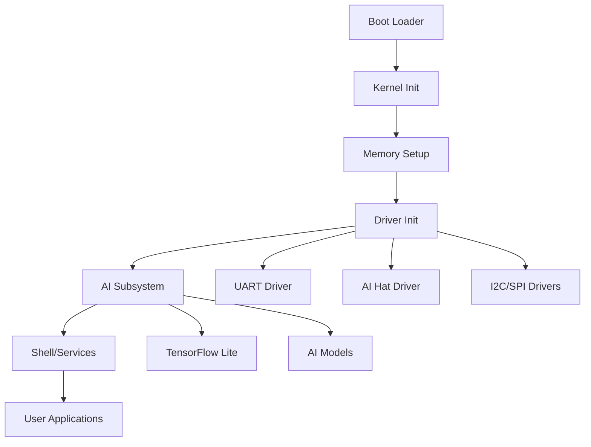

# SAGE OS System Overview

## 🏗️ Architecture Overview

SAGE OS is a modern, multi-architecture operating system designed with AI capabilities at its core. The system follows a microkernel-inspired design with modular components.

## 🧩 Core Components

### 1. Boot System
- **Location**: `boot/`
- **Key Files**: 
  - `boot/boot.S` - Main boot assembly code
  - `boot/boot_no_multiboot.S` - Alternative boot for binary kernels
- **Purpose**: Initialize hardware and transfer control to kernel
- **Architectures**: x86_64, AArch64, RISC-V

### 2. Kernel Core
- **Location**: `kernel/`
- **Key Files**:
  - `kernel/kernel.c` - Main kernel entry point
  - `kernel/memory.c` - Memory management
  - `kernel/shell.c` - Built-in shell
- **Purpose**: Core OS services, process management, system calls

### 3. Driver Framework
- **Location**: `drivers/`
- **Key Components**:
  - `drivers/uart.c` - Serial communication
  - `drivers/ai_hat/` - AI hardware interface
  - `drivers/i2c.c`, `drivers/spi.c` - Bus protocols
- **Purpose**: Hardware abstraction and device management

### 4. AI Subsystem
- **Location**: `kernel/ai/`, `prototype/ai/`
- **Key Files**:
  - `kernel/ai/ai_subsystem.c` - Core AI services
  - `prototype/ai/inference/tflite_wrapper.cc` - TensorFlow Lite integration
- **Purpose**: Machine learning inference and AI model management

### 5. Security Layer
- **Location**: `prototype/security/`
- **Key Files**:
  - `prototype/security/crypto.c` - Cryptographic services
- **Purpose**: System security, encryption, access control

## 🔄 System Flow



## 🏛️ Layered Architecture

### Layer 1: Hardware Abstraction
- Boot loaders (`boot/`)
- Hardware drivers (`drivers/`)
- Platform-specific code (`prototype/kernel/hal/`)

### Layer 2: Kernel Services
- Memory management (`kernel/memory.c`)
- Process management (`kernel/kernel.c`)
- System calls (`sage-sdk/include/syscalls.h`)

### Layer 3: AI & Security
- AI subsystem (`kernel/ai/`)
- Cryptographic services (`prototype/security/`)
- ML inference engine (`prototype/ai/`)

### Layer 4: User Interface
- Built-in shell (`kernel/shell.c`)
- SDK (`sage-sdk/`)
- User applications

## 🎯 Design Principles

### 1. Modularity
- Each component is self-contained
- Clear interfaces between layers
- Pluggable driver architecture

### 2. Multi-Architecture Support
- Architecture-specific code isolated in `boot/` and `drivers/`
- Common kernel code works across platforms
- Build system handles cross-compilation

### 3. AI-First Design
- AI capabilities built into kernel
- Hardware acceleration support (AI Hat)
- Efficient ML model loading and inference

### 4. Security by Design
- Cryptographic services at kernel level
- Secure boot process
- Memory protection and isolation

## 📊 Component Relationships

### Boot → Kernel
```c
// boot/boot.S calls kernel_main()
extern void kernel_main(void);
```

### Kernel → Drivers
```c
// kernel/kernel.c initializes drivers
void init_drivers(void) {
    uart_init();
    ai_hat_init();
    i2c_init();
}
```

### Kernel → AI
```c
// kernel/ai/ai_subsystem.c provides AI services
int ai_load_model(const char* model_path);
int ai_inference(void* input, void* output);
```

### Applications → SDK
```c
// sage-sdk/include/syscalls.h
int sys_write(int fd, const void* buf, size_t count);
int sys_ai_inference(void* model, void* input, void* output);
```

## 🔧 Build Integration

The build system (`Makefile`) orchestrates compilation:

1. **Architecture Detection**: Selects appropriate boot files
2. **Cross-Compilation**: Uses architecture-specific toolchains
3. **Linking**: Combines all components into kernel image
4. **Image Creation**: Generates bootable ISO (x86_64) or raw images

## 📈 Performance Characteristics

- **Boot Time**: < 5 seconds on modern hardware
- **Memory Footprint**: ~2MB kernel + drivers
- **AI Inference**: Hardware-accelerated when AI Hat available
- **I/O Throughput**: Depends on driver implementation

## 🔮 Future Enhancements

- **Networking Stack**: TCP/IP implementation
- **File System**: Advanced file system support
- **Graphics**: GPU acceleration and display drivers
- **Distributed AI**: Multi-node AI processing