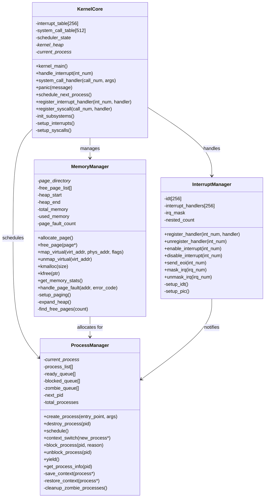
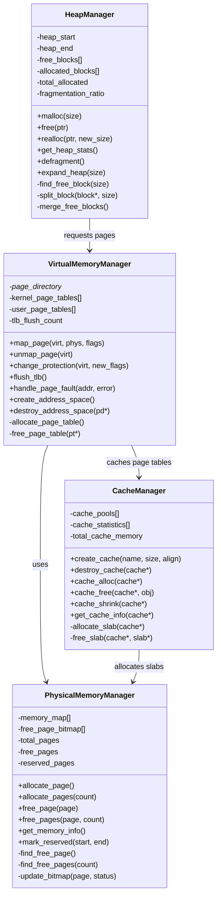
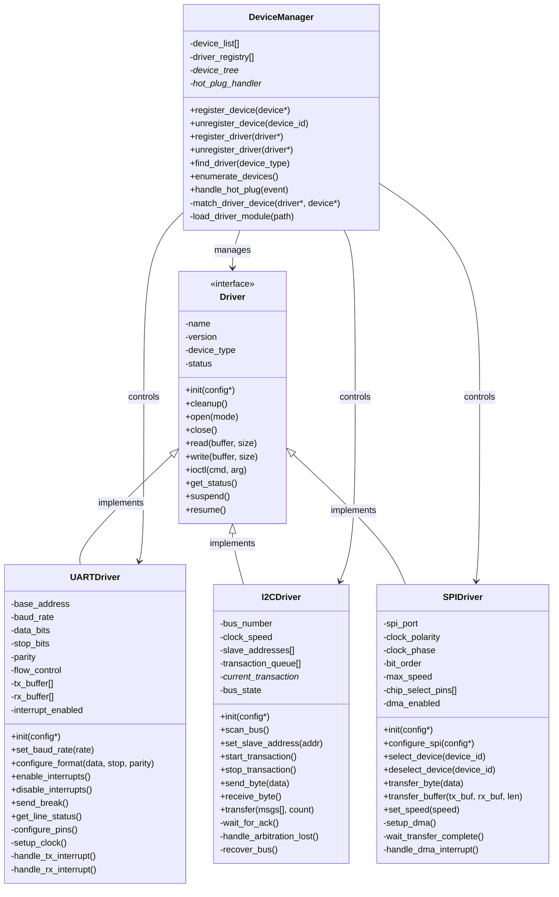
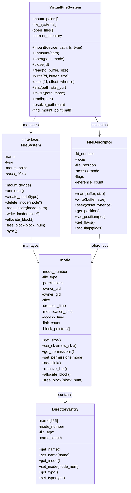
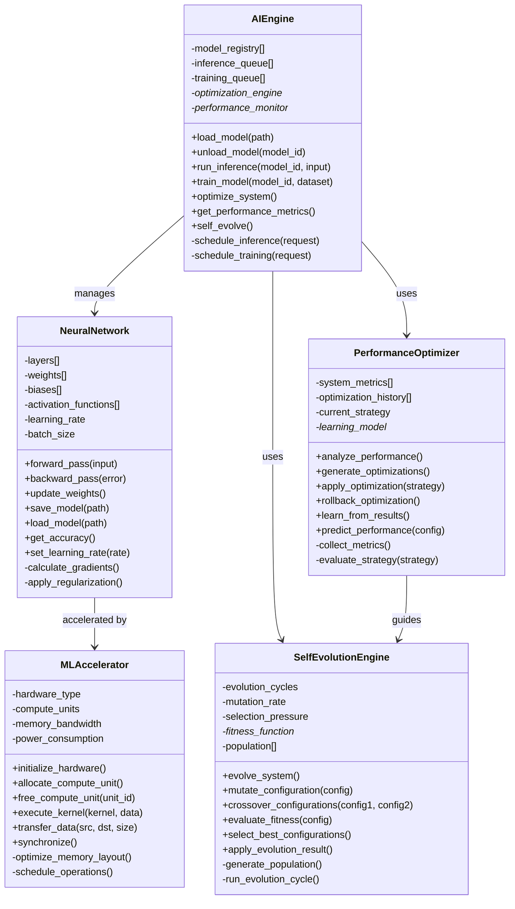
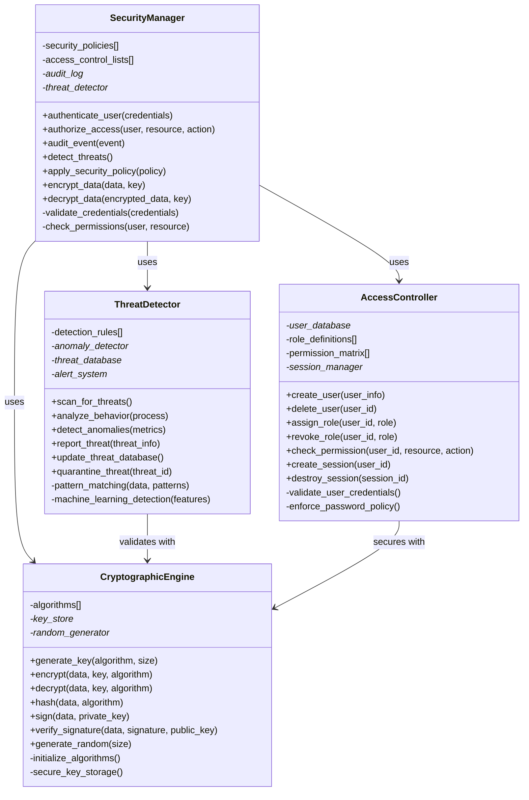
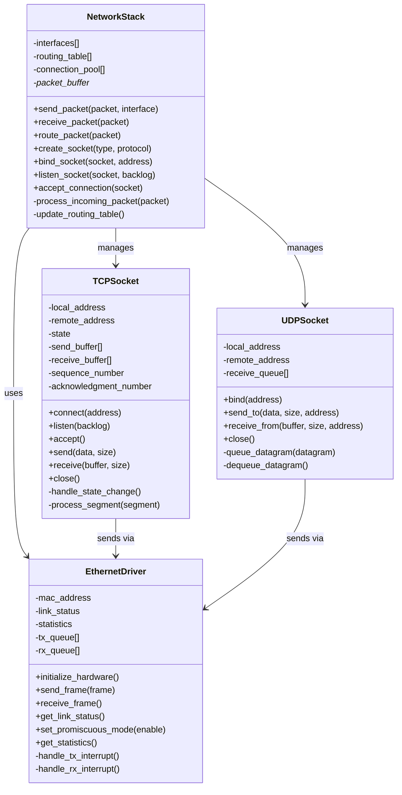
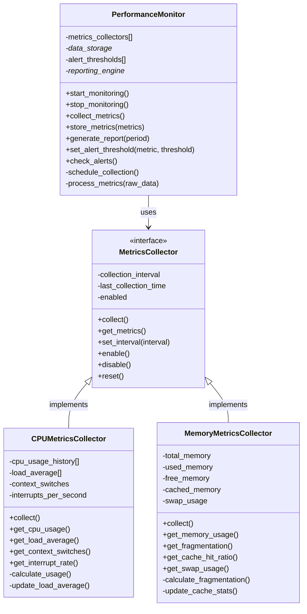
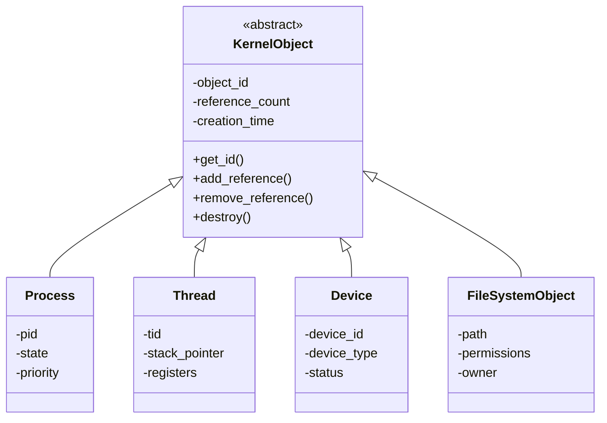
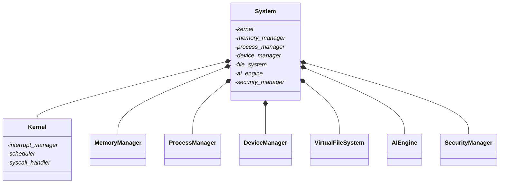

# Kernel Class Diagrams

## Overview

This document provides comprehensive class diagrams for the SAGE OS kernel components, showing their relationships, inheritance hierarchies, and interactions.

## 🧠 Core Kernel Classes

### Kernel Core Architecture



### Process and Thread Management

```mermaid
classDiagram
    class Process {
        -pid
        -parent_pid
        -state
        -priority
        -cpu_time
        -memory_usage
        -page_directory*
        -file_descriptors[]
        -signal_handlers[]
        +get_pid()
        +get_state()
        +set_priority(priority)
        +send_signal(signal)
        +add_file_descriptor(fd)
        +remove_file_descriptor(fd)
        +allocate_memory(size)
        +free_memory(ptr)
    }

    class Thread {
        -tid
        -process*
        -stack_pointer
        -registers
        -state
        -priority
        -cpu_affinity
        +get_tid()
        +get_state()
        +set_affinity(cpu_mask)
        +suspend()
        +resume()
        +join()
        +detach()
    }

    class Scheduler {
        -ready_queues[MAX_PRIORITY]
        -current_thread*
        -time_slice
        -load_balancer*
        +schedule_next()
        +add_thread(thread*)
        +remove_thread(thread*)
        +set_priority(thread*, priority)
        +yield_cpu()
        +preempt_current()
        -select_next_thread()
        -update_statistics()
    }

    class LoadBalancer {
        -cpu_loads[]
        -migration_threshold
        -last_balance_time
        +balance_load()
        +migrate_thread(thread*, target_cpu)
        +get_cpu_load(cpu_id)
        +should_migrate(thread*)
        -calculate_load_average()
        -find_least_loaded_cpu()
    }

    Process ||--o{ Thread : contains
    Scheduler --> Thread : manages
    Scheduler --> LoadBalancer : uses
    LoadBalancer --> Thread : migrates
```

## 💾 Memory Management Classes

### Memory Subsystem Architecture



## 🔌 Device Driver Framework

### Driver Architecture



## 🗂️ File System Classes

### File System Architecture



## 🤖 AI Engine Classes

### AI Subsystem Architecture



## 🛡️ Security Classes

### Security Framework



## 🌐 Network Stack Classes (Future)

### Network Architecture



## 📊 Performance Monitoring Classes

### Monitoring Framework



## 🔗 Class Relationships Summary

### Inheritance Hierarchy



### Composition Relationships



---

*Class diagrams last updated: 2025-05-27*