# Boot Sequence Diagrams

## Overview

This document provides detailed sequence diagrams showing the boot process of SAGE OS across different architectures and scenarios.

## 🚀 System Boot Process

### Complete Boot Sequence

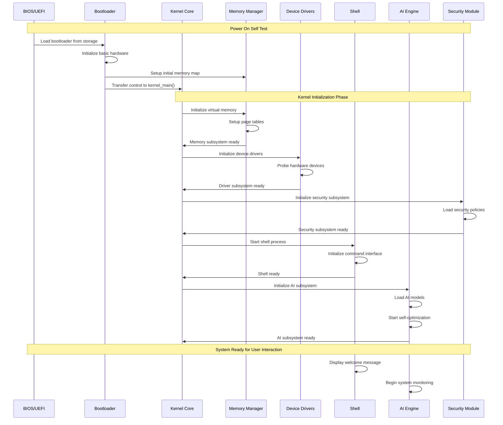

### Architecture-Specific Boot Sequences

#### x86_64 Boot Sequence

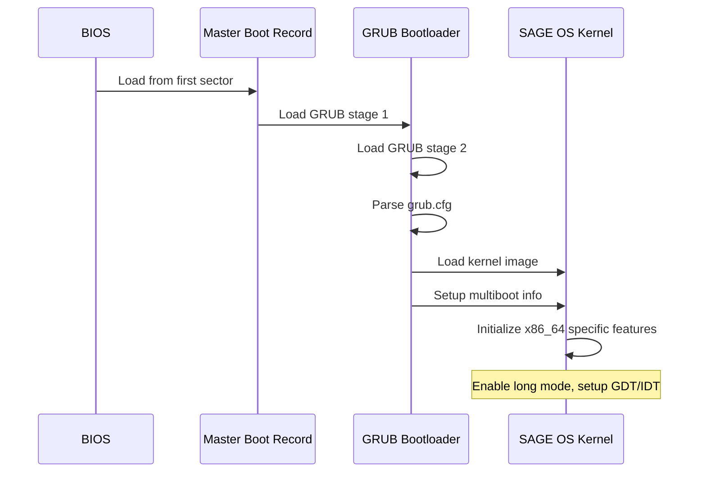

#### ARM64 Boot Sequence (Raspberry Pi)

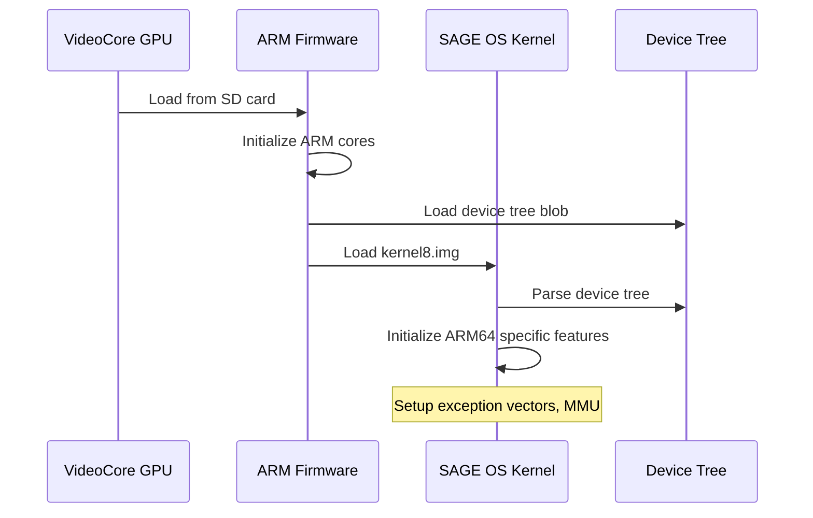

#### RISC-V Boot Sequence

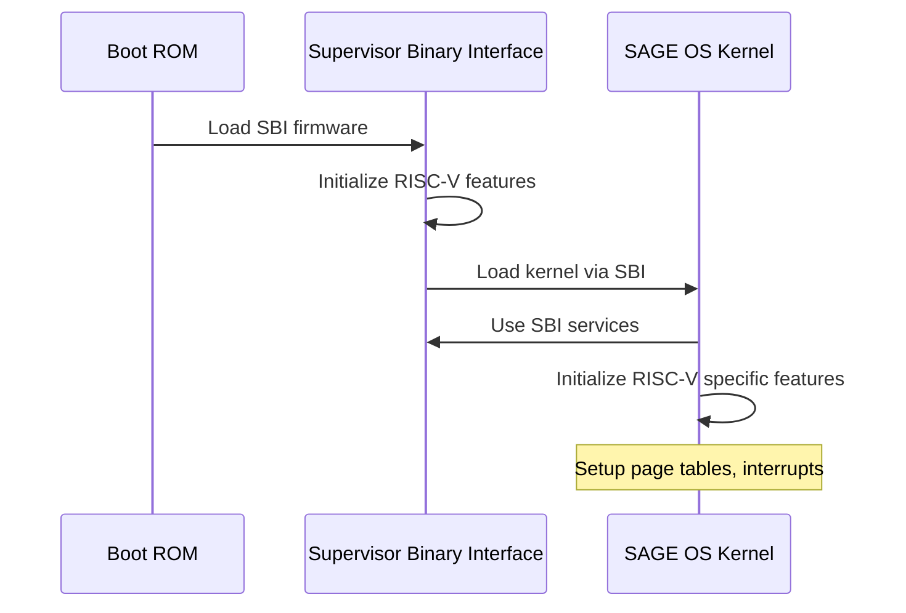

## 🧠 Memory Initialization Sequence

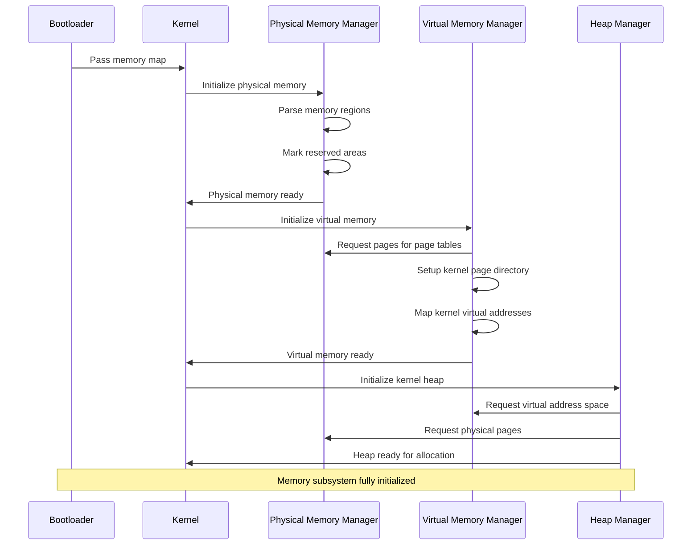

## 🔌 Driver Initialization Sequence

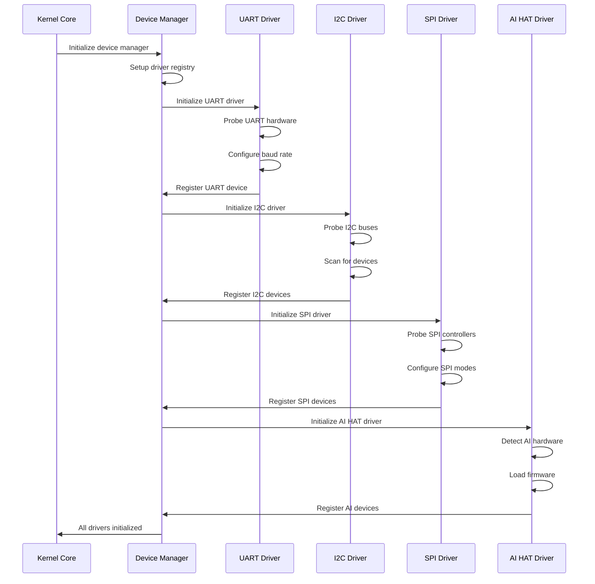

## 🛡️ Security Initialization Sequence

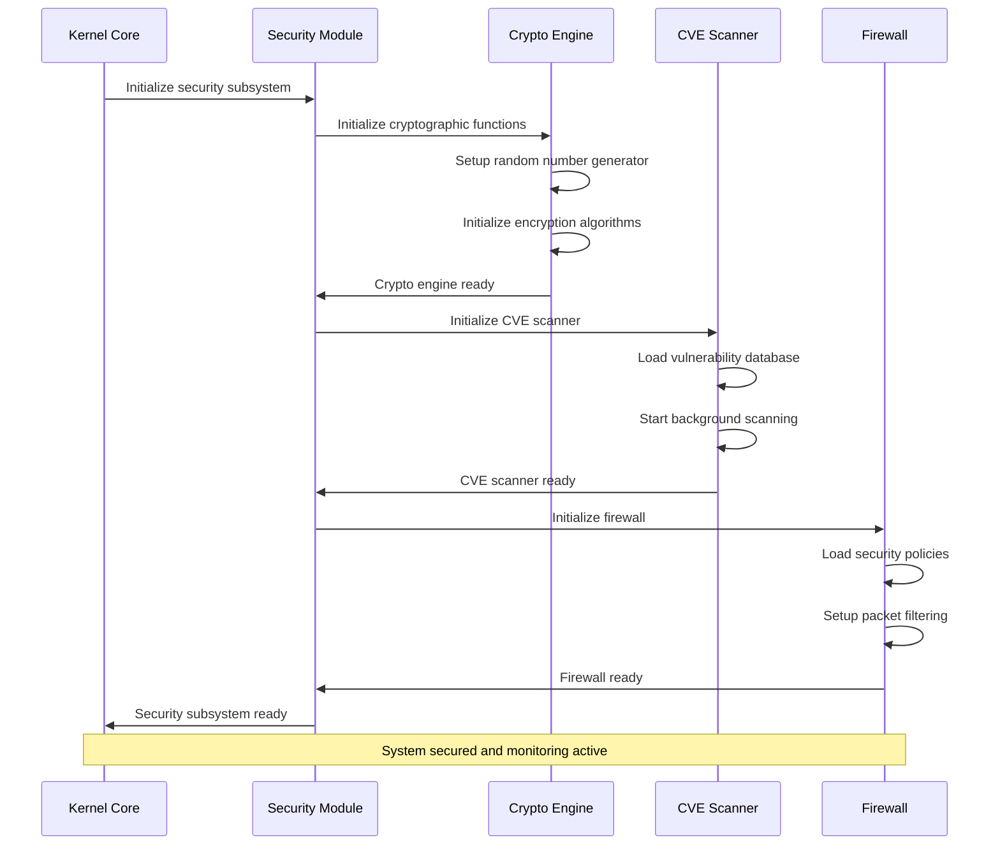

## 🤖 AI Subsystem Initialization

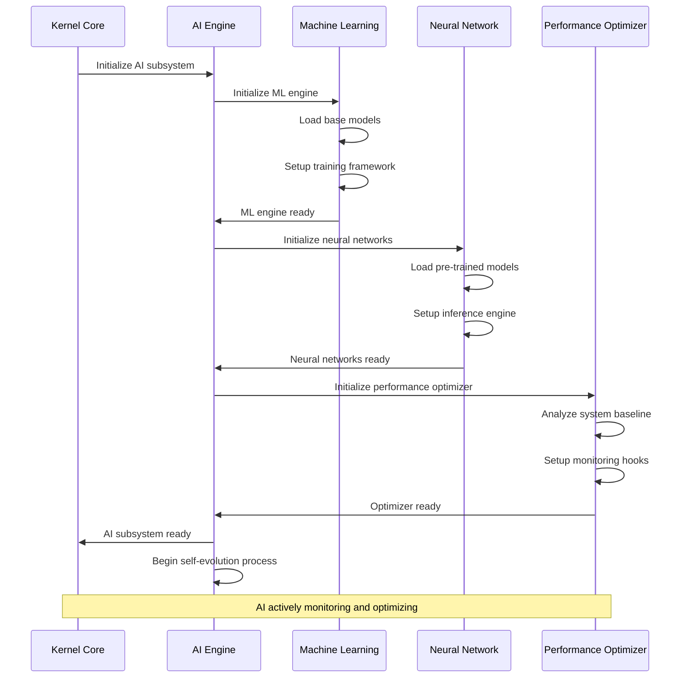

## 🔄 Process Scheduling Initialization

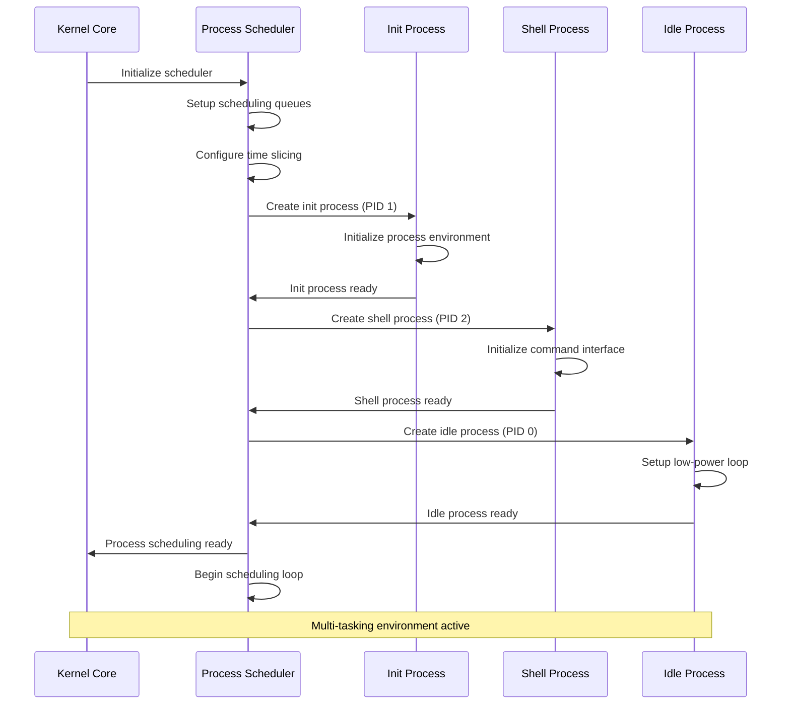

## 🌐 Network Stack Initialization (Future)

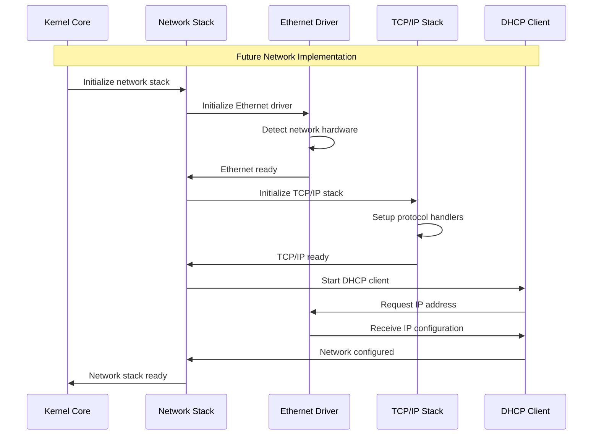

## 🔧 Error Handling During Boot

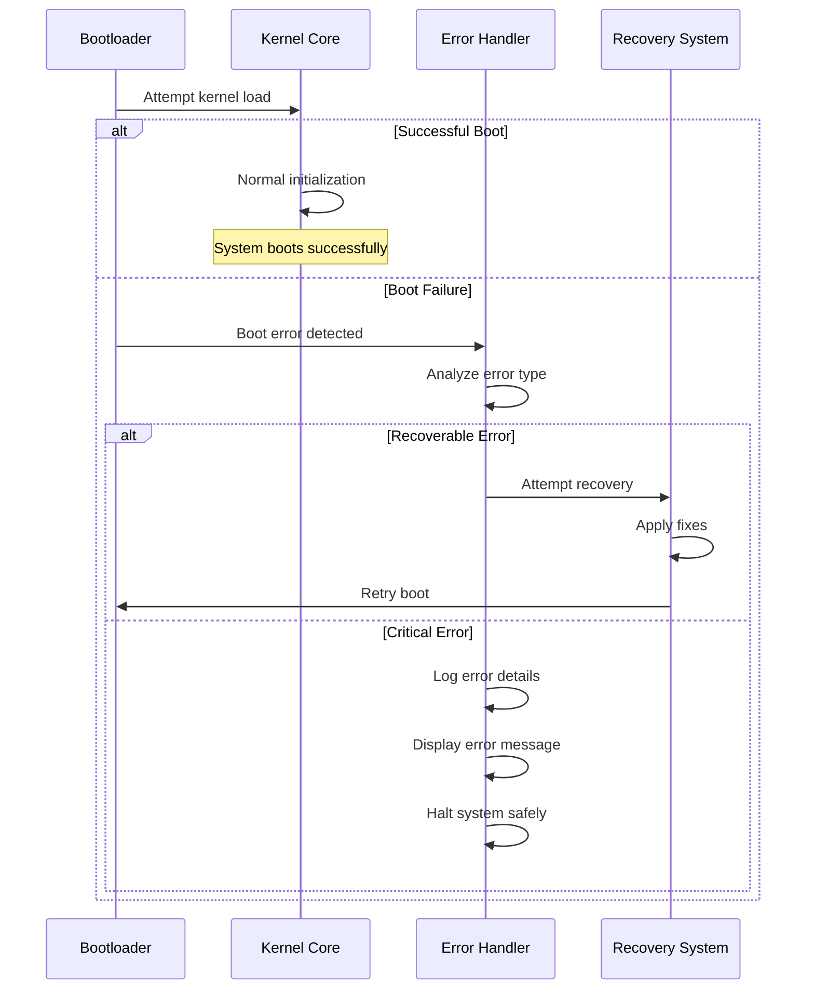

## 📊 Boot Performance Metrics

### Boot Time Analysis

```mermaid
gantt
    title Boot Time Breakdown
    dateFormat X
    axisFormat %s
    
    section Hardware
    BIOS/UEFI     :0, 2
    
    section Bootloader
    Load Bootloader :2, 3
    Initialize HW   :3, 4
    
    section Kernel
    Kernel Load     :4, 6
    Memory Init     :6, 8
    Driver Init     :8, 12
    Security Init   :12, 14
    AI Init         :14, 18
    
    section User Space
    Shell Start     :18, 20
    System Ready    :20, 22
```

### Performance Targets

| Phase | Target Time | Current Time | Status |
|-------|-------------|--------------|--------|
| Hardware Init | 2s | 2.1s | 🟡 |
| Bootloader | 1s | 0.8s | 🟢 |
| Kernel Load | 2s | 1.9s | 🟢 |
| Memory Init | 2s | 2.2s | 🟡 |
| Driver Init | 4s | 3.8s | 🟢 |
| Security Init | 2s | 1.9s | 🟢 |
| AI Init | 4s | 4.2s | 🟡 |
| Shell Start | 2s | 1.8s | 🟢 |
| **Total** | **19s** | **18.7s** | 🟢 |

## 🎯 Boot Optimization Strategies

### Current Optimizations

1. **Parallel Initialization**
   - Drivers initialized concurrently
   - AI models loaded in background
   - Non-critical services deferred

2. **Lazy Loading**
   - Load drivers on-demand
   - Initialize AI features progressively
   - Defer non-essential services

3. **Caching**
   - Cache frequently used data
   - Pre-compile critical paths
   - Optimize memory layout

### Future Improvements

- [ ] Implement fast boot mode
- [ ] Add hibernation support
- [ ] Optimize AI model loading
- [ ] Reduce driver initialization time
- [ ] Implement boot splash screen

---

*Boot sequence documentation last updated: 2025-05-27*