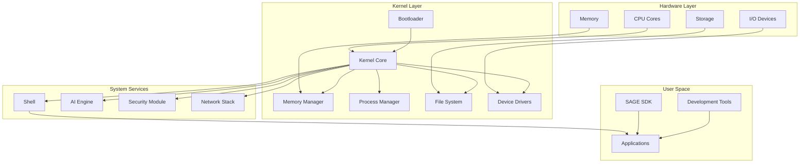
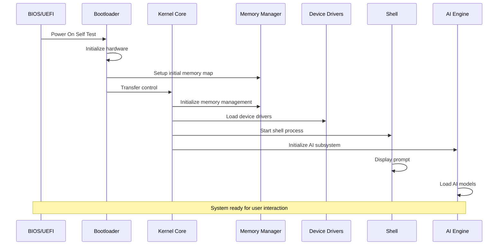
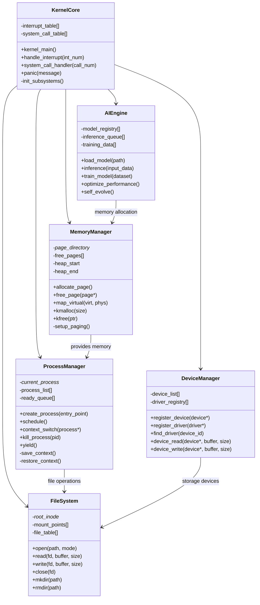
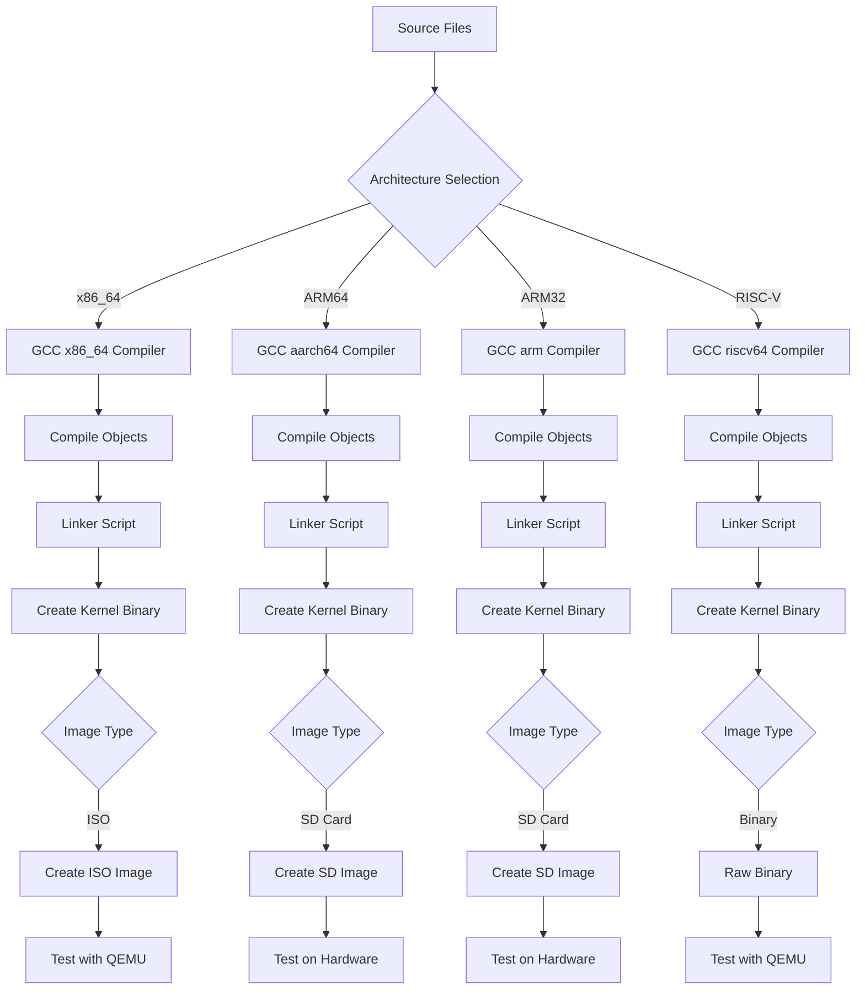

# System Architecture Diagrams

## Overview

This document provides comprehensive visual representations of the SAGE OS architecture using various diagram types including sequence diagrams, class diagrams, UML diagrams, and flowcharts.

## System Overview Diagram

## Boot Sequence Diagram

## Kernel Architecture Class Diagram

## Build System Flow

---

*These diagrams provide a comprehensive visual representation of the SAGE OS architecture and are automatically updated with system changes.*