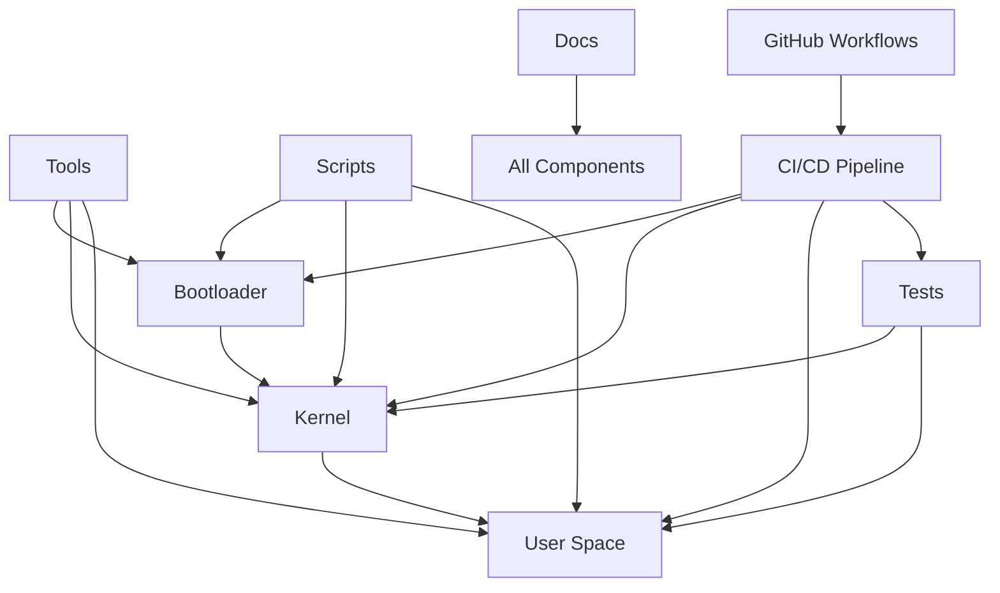

# Project Structure

This document provides a comprehensive overview of the SAGE OS project structure, explaining the role and purpose of each directory and key files.

## 📁 Root Directory Structure

```
SAGE-OS/
├── 📄 README.md                    # Project overview and quick start
├── 📄 LICENSE                      # BSD 3-Clause license
├── 📄 COMMERCIAL_TERMS.md          # Commercial licensing terms
├── 📄 CONTRIBUTING.md              # Contribution guidelines
├── 📄 SECURITY.md                  # Security policy and reporting
├── 📄 Cargo.toml                   # Rust workspace configuration
├── 📄 Makefile                     # Main build system
├── 📄 mkdocs.yml                   # Documentation configuration
├── 📄 .gitignore                   # Git ignore patterns
├── 📄 .gitattributes               # Git attributes
├── 🥾 bootloader/                  # Bootloader implementation
├── 🧠 kernel/                      # Kernel source code
├── 👥 userspace/                   # User space applications
├── 🔧 tools/                       # Development and build tools
├── 📚 docs/                        # Documentation source
├── 🧪 tests/                       # Test suites
├── 📦 scripts/                     # Build and utility scripts
├── 🏗️ build/                       # Build artifacts (generated)
├── 📀 dist/                        # Distribution files (generated)
└── 🔧 .github/                     # GitHub workflows and templates
```

## 🥾 Bootloader (`bootloader/`)

The bootloader directory contains the multi-stage boot process implementation.

```
bootloader/
├── 📄 Cargo.toml                   # Bootloader workspace
├── 📄 Makefile                     # Bootloader build system
├── 🔧 stage1/                      # First stage bootloader
│   ├── 📄 Cargo.toml               # Stage 1 configuration
│   ├── 📄 src/
│   │   ├── 📄 main.rs              # Stage 1 entry point
│   │   ├── 📄 boot.s               # Assembly boot code
│   │   └── 📄 lib.rs               # Stage 1 library
│   └── 📄 linker.ld                # Linker script
├── 🔧 stage2/                      # Second stage bootloader
│   ├── 📄 Cargo.toml               # Stage 2 configuration
│   ├── 📄 src/
│   │   ├── 📄 main.rs              # Stage 2 entry point
│   │   ├── 📄 memory.rs            # Memory detection
│   │   ├── 📄 disk.rs              # Disk I/O
│   │   ├── 📄 elf.rs               # ELF loader
│   │   └── 📄 graphics.rs          # Graphics initialization
│   └── 📄 linker.ld                # Linker script
├── 🔧 uefi/                        # UEFI boot support
│   ├── 📄 Cargo.toml               # UEFI configuration
│   ├── 📄 src/
│   │   ├── 📄 main.rs              # UEFI entry point
│   │   ├── 📄 protocols.rs         # UEFI protocols
│   │   └── 📄 services.rs          # UEFI services
│   └── 📄 build.rs                 # Build script
└── 🔧 common/                      # Shared bootloader code
    ├── 📄 Cargo.toml               # Common library
    └── 📄 src/
        ├── 📄 lib.rs               # Common library
        ├── 📄 console.rs           # Console output
        ├── 📄 memory_map.rs        # Memory mapping
        └── 📄 boot_info.rs         # Boot information
```

### Key Files

| File | Purpose | Architecture Support |
|------|---------|---------------------|
| `stage1/src/boot.s` | Initial assembly boot code | x86_64, ARM64 |
| `stage2/src/main.rs` | Extended bootloader logic | All |
| `uefi/src/main.rs` | UEFI boot implementation | x86_64, ARM64 |
| `common/src/boot_info.rs` | Boot information structure | All |

## 🧠 Kernel (`kernel/`)

The kernel directory contains the core operating system implementation.

```
kernel/
├── 📄 Cargo.toml                   # Kernel workspace
├── 📄 Makefile                     # Kernel build system
├── 📄 src/
│   ├── 📄 main.rs                  # Kernel entry point
│   ├── 📄 lib.rs                   # Kernel library
│   ├── 📄 panic.rs                 # Panic handler
│   └── 📄 allocator.rs             # Memory allocator
├── 🏗️ arch/                        # Architecture-specific code
│   ├── 🔧 x86_64/                  # x86_64 implementation
│   │   ├── 📄 mod.rs               # Architecture module
│   │   ├── 📄 boot.rs              # Boot initialization
│   │   ├── 📄 interrupts.rs        # Interrupt handling
│   │   ├── 📄 memory.rs            # Memory management
│   │   ├── 📄 gdt.rs               # Global Descriptor Table
│   │   ├── 📄 idt.rs               # Interrupt Descriptor Table
│   │   ├── 📄 paging.rs            # Page table management
│   │   └── 📄 syscalls.rs          # System call interface
│   ├── 🔧 aarch64/                 # ARM64 implementation
│   │   ├── 📄 mod.rs               # Architecture module
│   │   ├── 📄 boot.rs              # Boot initialization
│   │   ├── 📄 exceptions.rs        # Exception handling
│   │   ├── 📄 memory.rs            # Memory management
│   │   ├── 📄 mmu.rs               # Memory Management Unit
│   │   └── 📄 syscalls.rs          # System call interface
│   └── 🔧 riscv64/                 # RISC-V implementation
│       ├── 📄 mod.rs               # Architecture module
│       ├── 📄 boot.rs              # Boot initialization
│       ├── 📄 traps.rs             # Trap handling
│       ├── 📄 memory.rs            # Memory management
│       ├── 📄 paging.rs            # Page table management
│       └── 📄 syscalls.rs          # System call interface
├── 🔧 drivers/                     # Device drivers
│   ├── 📄 mod.rs                   # Driver module
│   ├── 📄 console.rs               # Console driver
│   ├── 📄 keyboard.rs              # Keyboard driver
│   ├── 📄 mouse.rs                 # Mouse driver
│   ├── 📄 storage.rs               # Storage drivers
│   ├── 📄 network.rs               # Network drivers
│   ├── 📄 graphics.rs              # Graphics drivers
│   └── 📄 usb.rs                   # USB drivers
├── 🔧 fs/                          # File system implementation
│   ├── 📄 mod.rs                   # File system module
│   ├── 📄 vfs.rs                   # Virtual File System
│   ├── 📄 ext4.rs                  # EXT4 file system
│   ├── 📄 fat32.rs                 # FAT32 file system
│   ├── 📄 tmpfs.rs                 # Temporary file system
│   └── 📄 procfs.rs                # Process file system
├── 🔧 mm/                          # Memory management
│   ├── 📄 mod.rs                   # Memory module
│   ├── 📄 allocator.rs             # Kernel allocator
│   ├── 📄 vmm.rs                   # Virtual memory manager
│   ├── 📄 pmm.rs                   # Physical memory manager
│   ├── 📄 heap.rs                  # Heap management
│   └── 📄 slab.rs                  # Slab allocator
├── 🔧 proc/                        # Process management
│   ├── 📄 mod.rs                   # Process module
│   ├── 📄 scheduler.rs             # Process scheduler
│   ├── 📄 task.rs                  # Task management
│   ├── 📄 thread.rs                # Thread management
│   ├── 📄 ipc.rs                   # Inter-process communication
│   └── 📄 signal.rs                # Signal handling
├── 🔧 net/                         # Network stack
│   ├── 📄 mod.rs                   # Network module
│   ├── 📄 ethernet.rs              # Ethernet protocol
│   ├── 📄 ip.rs                    # IP protocol
│   ├── 📄 tcp.rs                   # TCP protocol
│   ├── 📄 udp.rs                   # UDP protocol
│   └── 📄 socket.rs                # Socket interface
└── 🔧 sync/                        # Synchronization primitives
    ├── 📄 mod.rs                   # Sync module
    ├── 📄 mutex.rs                 # Mutex implementation
    ├── 📄 rwlock.rs                # Read-write lock
    ├── 📄 semaphore.rs             # Semaphore
    └── 📄 atomic.rs                # Atomic operations
```

### Architecture-Specific Code

Each architecture has its own subdirectory with platform-specific implementations:

=== "x86_64"
    - **Boot**: GRUB multiboot and UEFI support
    - **Interrupts**: IDT and interrupt handlers
    - **Memory**: Paging with 4-level page tables
    - **System Calls**: SYSCALL/SYSRET instructions

=== "ARM64"
    - **Boot**: Device tree and UEFI support
    - **Exceptions**: Exception level handling
    - **Memory**: ARMv8 MMU with translation tables
    - **System Calls**: SVC instruction

=== "RISC-V"
    - **Boot**: OpenSBI and device tree support
    - **Traps**: Supervisor trap handling
    - **Memory**: Sv48 virtual memory
    - **System Calls**: ECALL instruction

## 👥 User Space (`userspace/`)

User space applications and system services.

```
userspace/
├── 📄 Cargo.toml                   # Userspace workspace
├── 🔧 init/                        # Init system
│   ├── 📄 Cargo.toml               # Init configuration
│   └── 📄 src/
│       ├── 📄 main.rs              # Init process
│       ├── 📄 service.rs           # Service management
│       └── 📄 config.rs            # Configuration parser
├── 🔧 shell/                       # Command shell
│   ├── 📄 Cargo.toml               # Shell configuration
│   └── 📄 src/
│       ├── 📄 main.rs              # Shell main
│       ├── 📄 parser.rs            # Command parser
│       ├── 📄 builtins.rs          # Built-in commands
│       └── 📄 history.rs           # Command history
├── 🔧 utils/                       # System utilities
│   ├── 📄 ls/                      # List directory
│   ├── 📄 cat/                     # Display file contents
│   ├── 📄 cp/                      # Copy files
│   ├── 📄 mv/                      # Move files
│   ├── 📄 rm/                      # Remove files
│   ├── 📄 mkdir/                   # Create directory
│   ├── 📄 rmdir/                   # Remove directory
│   ├── 📄 ps/                      # Process status
│   ├── 📄 top/                     # System monitor
│   └── 📄 mount/                   # Mount file systems
├── 🔧 libs/                        # User space libraries
│   ├── 📄 libc/                    # C standard library
│   ├── 📄 libstd/                  # Standard library
│   └── 📄 libsage/                 # SAGE OS specific library
└── 🔧 apps/                        # Applications
    ├── 📄 editor/                  # Text editor
    ├── 📄 calculator/              # Calculator
    └── 📄 file_manager/            # File manager
```

## 🔧 Tools (`tools/`)

Development and build tools.

```
tools/
├── 📄 Cargo.toml                   # Tools workspace
├── 🔧 build-tools/                 # Build utilities
│   ├── 📄 iso-creator/             # ISO image creator
│   ├── 📄 cross-compiler/          # Cross-compilation setup
│   └── 📄 qemu-runner/             # QEMU test runner
├── 🔧 debug-tools/                 # Debugging utilities
│   ├── 📄 gdb-scripts/             # GDB debugging scripts
│   ├── 📄 memory-analyzer/         # Memory analysis tool
│   └── 📄 trace-viewer/            # Execution trace viewer
└── 🔧 dev-tools/                   # Development utilities
    ├── 📄 code-formatter/          # Code formatting tool
    ├── 📄 license-checker/         # License compliance checker
    └── 📄 doc-generator/           # Documentation generator
```

## 📚 Documentation (`docs/`)

Documentation source files and assets.

```
docs/
├── 📄 index.md                     # Main documentation page
├── 🔧 getting-started/             # Getting started guides
├── 🔧 architecture/                # Architecture documentation
├── 🔧 components/                  # Component documentation
├── 🔧 development/                 # Development guides
├── 🔧 security/                    # Security documentation
├── 🔧 files/                       # File reference
├── 🔧 api/                         # API documentation
├── 🔧 tutorials/                   # Tutorials
├── 🔧 troubleshooting/             # Troubleshooting guides
├── 🔧 assets/                      # Images and assets
├── 🔧 stylesheets/                 # Custom CSS
└── 🔧 javascripts/                 # Custom JavaScript
```

## 🧪 Tests (`tests/`)

Test suites and testing infrastructure.

```
tests/
├── 📄 Cargo.toml                   # Test workspace
├── 🔧 unit/                        # Unit tests
├── 🔧 integration/                 # Integration tests
├── 🔧 system/                      # System tests
├── 🔧 performance/                 # Performance tests
├── 🔧 security/                    # Security tests
└── 🔧 fixtures/                    # Test fixtures and data
```

## 📦 Scripts (`scripts/`)

Build and utility scripts.

```
scripts/
├── 📄 build.sh                     # Main build script
├── 📄 create-iso.sh                # ISO creation script
├── 📄 run-qemu.sh                  # QEMU execution script
├── 📄 setup-dev.sh                 # Development environment setup
├── 📄 cross-compile.sh             # Cross-compilation script
├── 📄 test-runner.sh               # Test execution script
├── 📄 deploy.sh                    # Deployment script
└── 🔧 ci/                          # CI/CD scripts
    ├── 📄 build-matrix.sh          # Multi-architecture build
    ├── 📄 security-scan.sh         # Security scanning
    └── 📄 deploy-docs.sh           # Documentation deployment
```

## 🔧 GitHub Workflows (`.github/`)

GitHub Actions workflows and templates.

```
.github/
├── 🔧 workflows/                   # GitHub Actions workflows
│   ├── 📄 ci.yml                   # Main CI/CD pipeline
│   ├── 📄 license-headers.yml      # License header checking
│   ├── 📄 documentation.yml       # Documentation generation
│   ├── 📄 security-scan.yml       # Security scanning
│   └── 📄 release.yml              # Release automation
├── 🔧 ISSUE_TEMPLATE/              # Issue templates
│   ├── 📄 bug_report.md            # Bug report template
│   ├── 📄 feature_request.md       # Feature request template
│   └── 📄 security_report.md       # Security report template
├── 📄 PULL_REQUEST_TEMPLATE.md     # Pull request template
├── 📄 CODEOWNERS                   # Code ownership
└── 📄 apply-license-headers.py     # License header application
```

## 🏗️ Build Artifacts (`build/` and `dist/`)

Generated directories containing build outputs.

```
build/                              # Build artifacts (gitignored)
├── 🔧 x86_64/                      # x86_64 build outputs
├── 🔧 aarch64/                     # ARM64 build outputs
└── 🔧 riscv64/                     # RISC-V build outputs

dist/                               # Distribution files (gitignored)
├── 📀 sage-os-x86_64.iso          # x86_64 ISO image
├── 📀 sage-os-aarch64.img         # ARM64 disk image
└── 📀 sage-os-riscv64.img         # RISC-V disk image
```

## 📄 Configuration Files

### Root Configuration Files

| File | Purpose | Format |
|------|---------|--------|
| `Cargo.toml` | Rust workspace configuration | TOML |
| `Makefile` | Main build system | Makefile |
| `mkdocs.yml` | Documentation configuration | YAML |
| `.gitignore` | Git ignore patterns | Text |
| `.gitattributes` | Git attributes | Text |

### Build Configuration

| File | Purpose | Architecture |
|------|---------|-------------|
| `bootloader/*/linker.ld` | Linker scripts | Specific |
| `kernel/arch/*/memory.x` | Memory layout | Specific |
| `scripts/qemu-*.sh` | QEMU configurations | Specific |

## 🔍 File Relationships



## 📊 File Statistics

| Component | Files | Lines of Code | Languages |
|-----------|-------|---------------|-----------|
| Bootloader | ~50 | ~5,000 | Rust, Assembly |
| Kernel | ~200 | ~25,000 | Rust, Assembly |
| User Space | ~100 | ~10,000 | Rust, C |
| Tools | ~30 | ~3,000 | Rust, Shell |
| Documentation | ~50 | ~15,000 | Markdown |
| Tests | ~80 | ~8,000 | Rust |
| Scripts | ~20 | ~2,000 | Shell, Python |

## 🎯 Key Design Principles

1. **Modularity**: Clear separation of concerns
2. **Architecture Independence**: Common interfaces across platforms
3. **Security**: Secure coding practices throughout
4. **Testing**: Comprehensive test coverage
5. **Documentation**: Extensive documentation for all components
6. **Maintainability**: Clean, readable code structure

## 📝 File Naming Conventions

- **Rust files**: `snake_case.rs`
- **Assembly files**: `snake_case.s` or `snake_case.asm`
- **Documentation**: `kebab-case.md`
- **Scripts**: `kebab-case.sh` or `snake_case.py`
- **Configuration**: `kebab-case.yml` or `snake_case.toml`

## 🔗 Related Documentation

- [Architecture Overview](../architecture/overview.md)
- [Build System](../components/build-system.md)
- [Development Setup](../getting-started/development-setup.md)
- [Contributing Guidelines](../development/contributing.md)