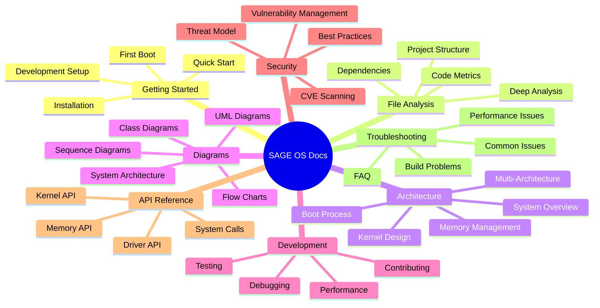
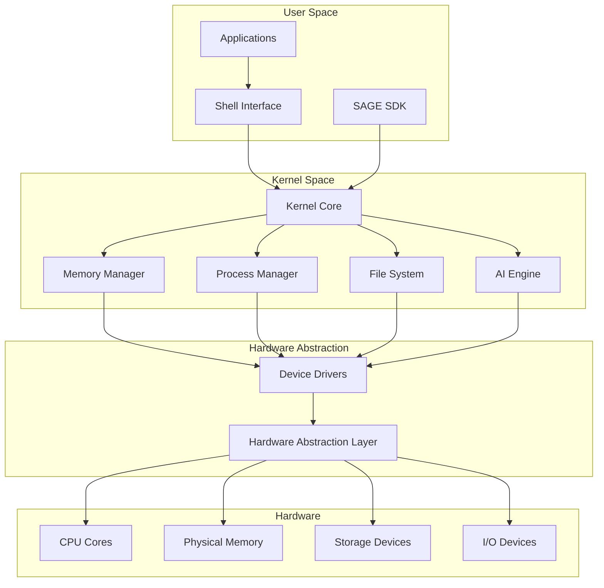
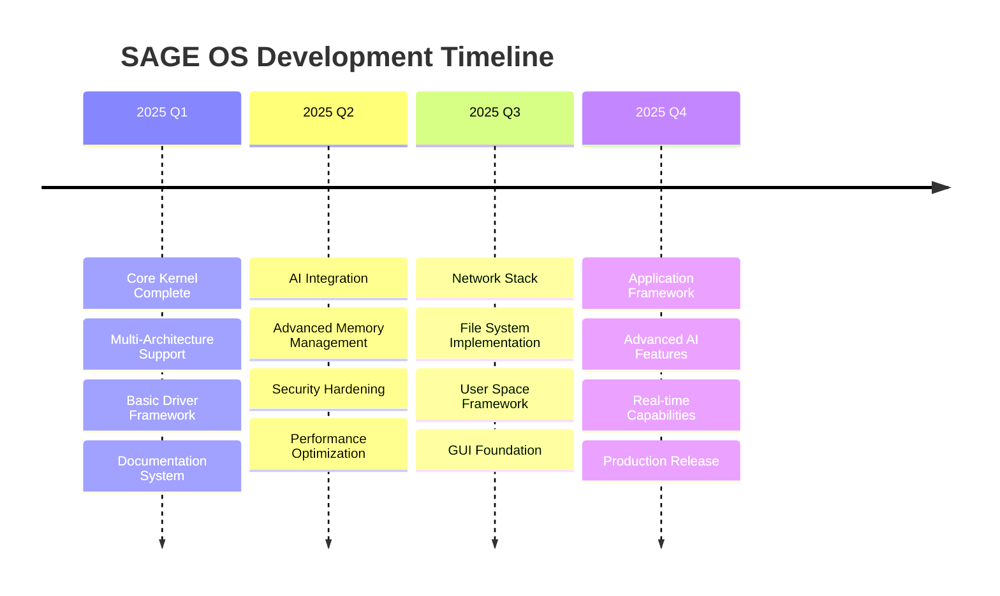

# SAGE OS Documentation

Welcome to the comprehensive documentation for SAGE OS - a modern, self-evolving operating system designed for multi-architecture support and AI integration.

## 🎯 Quick Navigation

-   :material-rocket-launch: **Getting Started**

    ---

    Get up and running with SAGE OS quickly

    [:octicons-arrow-right-24: Installation Guide](getting-started/installation.md)
    [:octicons-arrow-right-24: Quick Start](getting-started/quickstart.md)
    [:octicons-arrow-right-24: First Boot](getting-started/first-boot.md)

-   :material-file-tree: **Deep File Analysis**

    ---

    Comprehensive analysis of every file and folder

    [:octicons-arrow-right-24: Project Structure](files/project-structure.md)
    [:octicons-arrow-right-24: Deep File Analysis](files/deep-file-analysis.md)
    [:octicons-arrow-right-24: Code Metrics](files/metrics.md)

-   :material-chart-timeline: **Architecture Diagrams**

    ---

    Visual representations with sequence, class, and UML diagrams

    [:octicons-arrow-right-24: System Architecture](diagrams/system-architecture.md)
    [:octicons-arrow-right-24: Sequence Diagrams](diagrams/sequences/boot-sequence.md)
    [:octicons-arrow-right-24: Class Diagrams](diagrams/classes/kernel-classes.md)

-   :material-security: **Security & CVE**

    ---

    Comprehensive security analysis and vulnerability management

    [:octicons-arrow-right-24: CVE Scanning](security/cve-scanning.md)
    [:octicons-arrow-right-24: Security Model](security/overview.md)
    [:octicons-arrow-right-24: Best Practices](security/best-practices.md)

-   :material-api: **API Reference**

    ---

    Complete API documentation with code examples

    [:octicons-arrow-right-24: Kernel API](api/kernel.md)
    [:octicons-arrow-right-24: Driver API](api/drivers.md)
    [:octicons-arrow-right-24: System Calls](api/syscalls.md)

-   :material-help-circle: **Troubleshooting**

    ---

    Solutions to common issues and Q&A

    [:octicons-arrow-right-24: FAQ](troubleshooting/faq.md)
    [:octicons-arrow-right-24: Build Problems](troubleshooting/build-problems.md)
    [:octicons-arrow-right-24: Debug Guide](troubleshooting/debug.md)

## 🚀 About SAGE OS

SAGE OS is a next-generation operating system that combines traditional OS capabilities with modern AI-driven features. It supports multiple architectures including x86_64, ARM64, ARM32, and RISC-V, making it suitable for a wide range of hardware platforms from embedded systems to high-performance servers.

### ✨ Key Features

!!! tip "Multi-Architecture Support"
    Native support for x86_64, ARM64, ARM32, and RISC-V architectures with optimized builds for each platform.

!!! info "AI Integration"
    Built-in AI subsystem for system optimization, self-evolution, and intelligent resource management.

!!! warning "Security First"
    Comprehensive security model with automated CVE scanning, threat detection, and vulnerability management.

!!! success "Developer Friendly"
    Extensive documentation, comprehensive SDK, and modern development tools with deep code analysis.

### 📊 Project Statistics

-   **Lines of Code**

    ---

    
    
    

-   **Architectures**

    ---

    
    
    
    

-   **Test Coverage**

    ---

    
    
    

-   **Documentation**

    ---

    
    
    

## 🗺️ Documentation Structure

## 🔄 System Architecture Overview

## 📈 Development Roadmap

## 🤝 Community & Support

-   :fontawesome-brands-github: **GitHub Repository**

    ---

    Source code, issues, and discussions

    [Visit Repository](https://github.com/AshishYesale7/SAGE-OS){ .md-button .md-button--primary }

-   :material-email: **Contact**

    ---

    Get in touch with the development team

    [ashishyesale007@gmail.com](mailto:ashishyesale007@gmail.com){ .md-button }

-   :material-license: **License**

    ---

    Dual-licensed under BSD 3-Clause and Commercial License

    [View License](home/license.md){ .md-button }

-   :material-heart: **Contributing**

    ---

    Join our community of contributors

    [Contribution Guide](development/contributing.md){ .md-button }

## 🏆 Project Highlights

!!! example "Recent Achievements"
    - ✅ Multi-architecture build system implemented
    - ✅ Comprehensive CVE scanning integrated
    - ✅ Deep documentation system with diagrams
    - ✅ AI-driven system optimization
    - ✅ Automated testing framework
    - ✅ Security-first design principles

!!! quote "Vision Statement"
    "SAGE OS aims to be the most intelligent, secure, and adaptable operating system, capable of evolving and optimizing itself through advanced AI integration while maintaining compatibility across multiple hardware architectures."

---

**Last Updated**: 2025-05-27 | **Version**: 0.1.0 | **Build**: dev