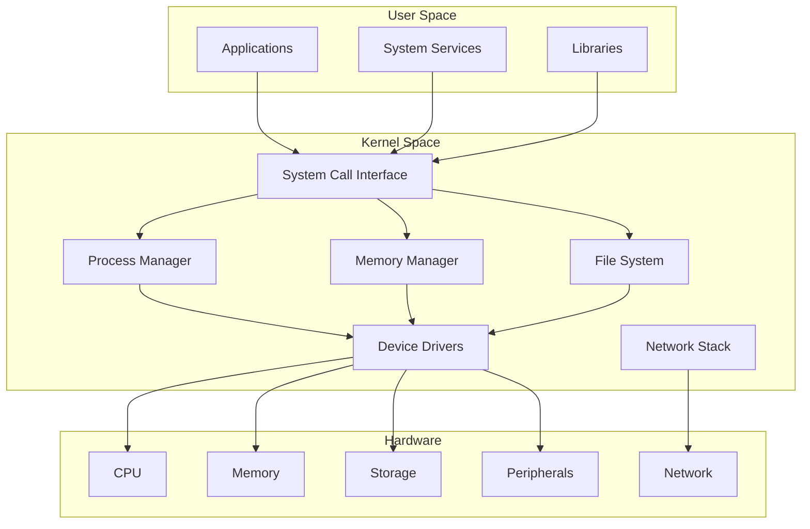
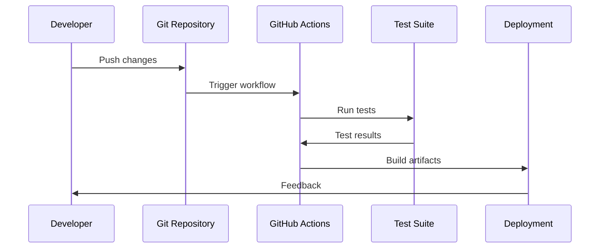

# SAGE OS Documentation

<div align="center">
  <h1>🚀 SAGE OS</h1>
  <p><strong>A Modern, Secure, Multi-Architecture Operating System</strong></p>
  
  [](https://github.com/NMC-TechClub/SAGE-OS/actions)
  [](LICENSE)
  [](https://nmc-techclub.github.io/SAGE-OS/)
  [](security/cve-scanning.md)
</div>

---

## 🌟 Welcome to SAGE OS

SAGE OS is a cutting-edge operating system designed from the ground up with modern computing principles. Built for the future of computing, it combines security, performance, and multi-architecture support in a clean, modular design.

### 🎯 Key Features

=== "🔒 Security First"
    - **Memory Safety**: Built with Rust for memory-safe system programming
    - **CVE Scanning**: Automated vulnerability detection and management
    - **Secure Boot**: Hardware-backed boot chain verification
    - **Isolation**: Strong process and memory isolation

=== "🏗️ Multi-Architecture"
    - **x86_64**: Full support for Intel/AMD 64-bit processors
    - **ARM64**: Native support for ARM64/AArch64 platforms
    - **RISC-V**: Cutting-edge RISC-V 64-bit support
    - **Cross-Compilation**: Unified build system for all architectures

=== "⚡ Performance"
    - **Zero-Copy I/O**: Efficient data handling
    - **NUMA Awareness**: Optimized for modern multi-core systems
    - **Real-Time Capabilities**: Low-latency scheduling
    - **Hardware Acceleration**: GPU and specialized processor support

=== "🔧 Developer Friendly"
    - **Modern Toolchain**: Rust-based development with C interop
    - **Comprehensive Testing**: Automated testing across all platforms
    - **Documentation**: Extensive documentation with examples
    - **CI/CD**: Robust continuous integration and deployment

---

## 🚀 Quick Start

Get up and running with SAGE OS in minutes:

```bash
# Clone the repository
git clone https://github.com/NMC-TechClub/SAGE-OS.git
cd SAGE-OS

# Build for your architecture
make build ARCH=x86_64

# Create bootable ISO
make iso ARCH=x86_64

# Run in emulator
make run ARCH=x86_64
```

[📖 Detailed Installation Guide →](getting-started/installation.md){ .md-button .md-button--primary }

---

## 🏛️ Architecture Overview



[🏗️ Detailed Architecture →](architecture/overview.md){ .md-button }

---

## 📁 Project Structure

The SAGE OS project is organized into logical components:

```
SAGE-OS/
├── 🥾 bootloader/          # Multi-stage bootloader
│   ├── stage1/            # Initial boot stage
│   ├── stage2/            # Extended bootloader
│   └── uefi/              # UEFI boot support
├── 🧠 kernel/             # Kernel implementation
│   ├── arch/              # Architecture-specific code
│   ├── drivers/           # Device drivers
│   ├── fs/                # File systems
│   ├── mm/                # Memory management
│   └── proc/              # Process management
├── 👥 userspace/          # User space components
│   ├── init/              # Init system
│   ├── shell/             # Command shell
│   └── utils/             # System utilities
├── 🔧 tools/              # Development tools
├── 📚 docs/               # Documentation
├── 🧪 tests/              # Test suites
└── 📦 scripts/            # Build scripts
```

[📂 Complete File Reference →](files/project-structure.md){ .md-button }

---

## 🛠️ Development Workflow



### Development Process

1. **🔀 Fork & Clone**: Start with your own fork
2. **🌿 Branch**: Create feature branches
3. **💻 Develop**: Write code following our standards
4. **🧪 Test**: Run comprehensive test suites
5. **📝 Document**: Update documentation
6. **🔍 Review**: Submit pull requests
7. **🚀 Deploy**: Automated deployment

[👨‍💻 Contributing Guide →](development/contributing.md){ .md-button }

---

## 🔒 Security & Compliance

SAGE OS takes security seriously with multiple layers of protection:

### Security Features

| Feature | Description | Status |
|---------|-------------|--------|
| 🛡️ Memory Safety | Rust-based memory management | ✅ Active |
| 🔐 Secure Boot | Hardware-backed verification | ✅ Active |
| 🔍 CVE Scanning | Automated vulnerability detection | ✅ Active |
| 🚫 ASLR | Address Space Layout Randomization | ✅ Active |
| 🔒 DEP/NX | Data Execution Prevention | ✅ Active |
| 🛡️ Stack Protection | Stack canaries and guards | ✅ Active |

### Vulnerability Management

We use automated tools to continuously monitor for security vulnerabilities:

- **CVE Binary Tool**: Scans all binaries for known vulnerabilities
- **Dependency Scanning**: Monitors third-party dependencies
- **Static Analysis**: Code analysis for security issues
- **Penetration Testing**: Regular security assessments

[🔒 Security Documentation →](security/overview.md){ .md-button }

---

## 📊 Platform Support

| Architecture | Status | Bootloader | Kernel | Userspace | Testing |
|--------------|--------|------------|--------|-----------|---------|
| x86_64 | ✅ Stable | ✅ GRUB/UEFI | ✅ Full | ✅ Complete | ✅ CI/CD |
| ARM64 | ✅ Stable | ✅ U-Boot | ✅ Full | ✅ Complete | ✅ CI/CD |
| RISC-V | 🚧 Beta | ✅ OpenSBI | ✅ Core | 🚧 Partial | ✅ CI/CD |

[🏗️ Multi-Architecture Guide →](architecture/multi-arch.md){ .md-button }

---

## 📚 Documentation Sections

<div class="grid cards" markdown>

-   :material-rocket-launch: **Getting Started**
    
    ---
    
    Quick setup and installation guides
    
    [:octicons-arrow-right-24: Installation](getting-started/installation.md)
    [:octicons-arrow-right-24: Building](getting-started/building.md)
    [:octicons-arrow-right-24: First Boot](getting-started/first-boot.md)

-   :material-cog: **Architecture**
    
    ---
    
    Deep dive into system design
    
    [:octicons-arrow-right-24: Overview](architecture/overview.md)
    [:octicons-arrow-right-24: Kernel](architecture/kernel.md)
    [:octicons-arrow-right-24: Memory](architecture/memory.md)

-   :material-code-braces: **Development**
    
    ---
    
    Developer resources and guides
    
    [:octicons-arrow-right-24: Contributing](development/contributing.md)
    [:octicons-arrow-right-24: Testing](development/testing.md)
    [:octicons-arrow-right-24: Debugging](development/debugging.md)

-   :material-shield-check: **Security**
    
    ---
    
    Security features and best practices
    
    [:octicons-arrow-right-24: Overview](security/overview.md)
    [:octicons-arrow-right-24: CVE Scanning](security/cve-scanning.md)
    [:octicons-arrow-right-24: Best Practices](security/best-practices.md)

</div>

---

## 🤝 Community & Support

### Get Involved

- **💬 Discussions**: Join our [GitHub Discussions](https://github.com/NMC-TechClub/SAGE-OS/discussions)
- **🐛 Issues**: Report bugs on [GitHub Issues](https://github.com/NMC-TechClub/SAGE-OS/issues)
- **📧 Contact**: Reach out to [ashishyesale007@gmail.com](mailto:ashishyesale007@gmail.com)

### Contributing

We welcome contributions of all kinds:

- 🐛 Bug reports and fixes
- ✨ New features and enhancements
- 📚 Documentation improvements
- 🧪 Test coverage expansion
- 🎨 UI/UX improvements

[🤝 How to Contribute →](development/contributing.md){ .md-button .md-button--primary }

---

## 📄 License

SAGE OS is dual-licensed to provide flexibility for different use cases:

- **🆓 Open Source**: BSD 3-Clause License for open source projects
- **💼 Commercial**: Commercial license for proprietary applications

[📄 License Details →](home/license.md){ .md-button }

---

<div align="center">
  <p><strong>Built with ❤️ by the SAGE OS Team</strong></p>
  <p>Copyright © 2025 Ashish Vasant Yesale</p>
</div>