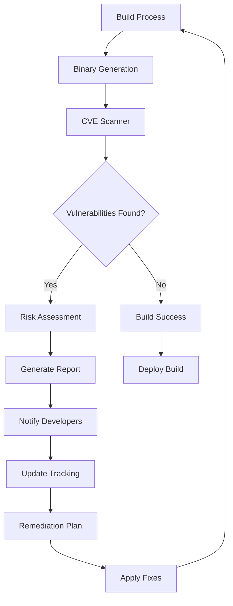
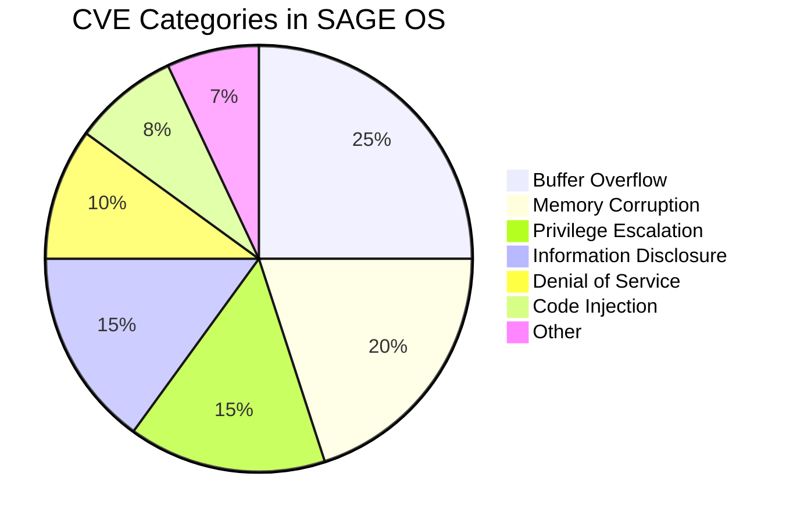
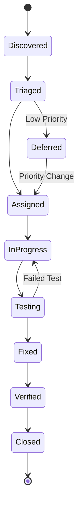
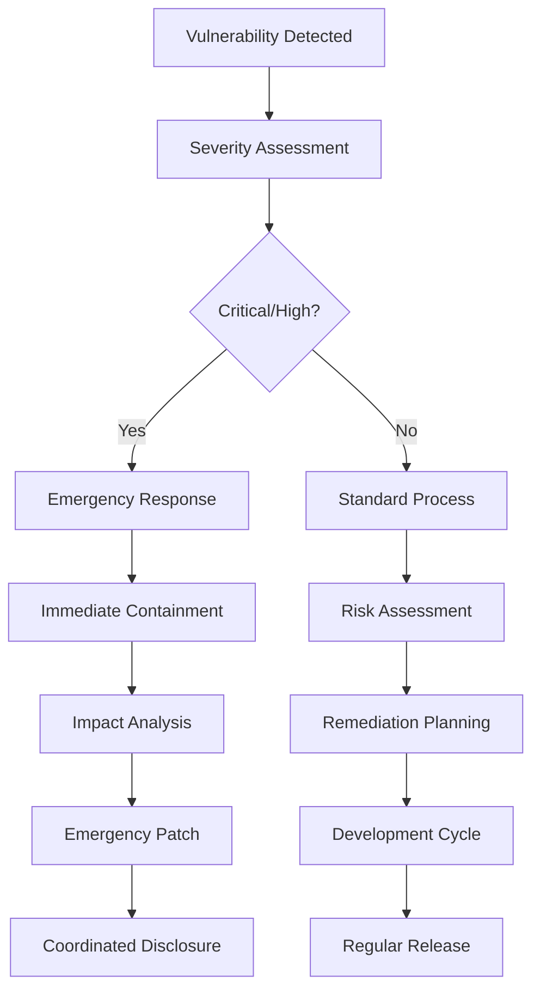

# CVE Scanning and Vulnerability Management

SAGE OS implements comprehensive vulnerability scanning using the Intel CVE Binary Tool and other security analysis tools to ensure system security and compliance.

## 🔍 Overview

The CVE (Common Vulnerabilities and Exposures) scanning system in SAGE OS provides:

- **Automated Scanning**: Continuous monitoring of all system binaries
- **Vulnerability Detection**: Identification of known security issues
- **Risk Assessment**: Prioritization of security threats
- **Remediation Tracking**: Management of security updates
- **Compliance Reporting**: Security audit trails

## 🛠️ CVE Binary Tool Integration

SAGE OS integrates the [Intel CVE Binary Tool](https://github.com/intel/cve-bin-tool) for comprehensive binary analysis.

### Installation and Setup

```bash
# Install CVE Binary Tool
pip install cve-bin-tool

# Update vulnerability database
cve-bin-tool --update

# Verify installation
cve-bin-tool --version
```

### Configuration

The CVE scanning is configured through the `.cve-bin-tool.toml` configuration file:

```toml
# .cve-bin-tool.toml
[cve-bin-tool]
# Database configuration
database_url = "https://nvd.nist.gov/feeds/json/cve/1.1/"
update_frequency = "daily"

# Scanning configuration
scan_depth = "deep"
include_patterns = [
    "*.so",
    "*.so.*",
    "kernel",
    "bootloader",
    "*.bin"
]

exclude_patterns = [
    "test/*",
    "debug/*",
    "*.debug"
]

# Reporting configuration
output_format = ["json", "html", "csv"]
severity_threshold = "medium"

# Integration settings
ci_integration = true
fail_on_cve = true
max_cve_score = 7.0
```

## 🔄 Automated Scanning Workflow



### GitHub Actions Integration

The CVE scanning is integrated into the CI/CD pipeline:

```yaml
# .github/workflows/security-scan.yml
name: Security Scan

on:
  push:
    branches: [ main, dev ]
  pull_request:
    branches: [ main, dev ]
  schedule:
    - cron: '0 2 * * *'  # Daily at 2 AM

jobs:
  cve-scan:
    name: CVE Binary Scan
    runs-on: ubuntu-latest
    
    steps:
      - name: Checkout Repository
        uses: actions/checkout@v4
        
      - name: Setup Python
        uses: actions/setup-python@v5
        with:
          python-version: '3.11'
          
      - name: Install CVE Binary Tool
        run: |
          pip install cve-bin-tool
          cve-bin-tool --update
          
      - name: Download Build Artifacts
        uses: actions/download-artifact@v4
        with:
          pattern: sageos-*
          path: artifacts/
          
      - name: Run CVE Scan
        run: |
          mkdir -p reports
          cve-bin-tool \
            --format json \
            --format html \
            --format csv \
            --output-file reports/cve-report \
            --log-level INFO \
            --config .cve-bin-tool.toml \
            artifacts/
            
      - name: Upload Security Reports
        uses: actions/upload-artifact@v4
        with:
          name: security-reports
          path: reports/
          retention-days: 90
          
      - name: Security Summary
        run: |
          echo "## 🔒 Security Scan Results" >> $GITHUB_STEP_SUMMARY
          if [ -f reports/cve-report.json ]; then
            python3 scripts/parse-cve-report.py reports/cve-report.json >> $GITHUB_STEP_SUMMARY
          fi
```

## 📊 Vulnerability Analysis

### Scanning Scope

The CVE scanner analyzes the following components:

| Component | Files Scanned | Risk Level |
|-----------|---------------|------------|
| Kernel Binaries | `kernel`, `*.ko` | Critical |
| Bootloader | `stage1`, `stage2`, `*.efi` | Critical |
| System Libraries | `*.so`, `*.so.*` | High |
| User Applications | User space binaries | Medium |
| Development Tools | Build tools, utilities | Low |

### Vulnerability Categories



### Risk Assessment Matrix

| Severity | CVSS Score | Action Required | Timeline |
|----------|------------|-----------------|----------|
| Critical | 9.0 - 10.0 | Immediate fix | 24 hours |
| High | 7.0 - 8.9 | Priority fix | 7 days |
| Medium | 4.0 - 6.9 | Scheduled fix | 30 days |
| Low | 0.1 - 3.9 | Monitor | 90 days |

## 🛡️ Security Scanning Tools

### Primary Tools

1. **CVE Binary Tool**
   - Binary vulnerability scanning
   - NIST NVD database integration
   - Automated reporting

2. **Cargo Audit**
   - Rust dependency scanning
   - Advisory database checking
   - Dependency tree analysis

3. **Clippy Security Lints**
   - Static code analysis
   - Security-focused linting
   - Best practice enforcement

### Scanning Commands

```bash
# Comprehensive CVE scan
cve-bin-tool --format json --output-file cve-report.json dist/

# Rust dependency audit
cargo audit --format json --output audit-report.json

# Security-focused clippy lints
cargo clippy -- -W clippy::all -W clippy::pedantic -W clippy::security

# Custom security analysis
./scripts/security-analysis.sh --full-scan --report-format html
```

## 📈 Vulnerability Tracking

### Database Schema

```sql
-- Vulnerability tracking database
CREATE TABLE vulnerabilities (
    id SERIAL PRIMARY KEY,
    cve_id VARCHAR(20) NOT NULL,
    component VARCHAR(100) NOT NULL,
    severity VARCHAR(10) NOT NULL,
    cvss_score DECIMAL(3,1),
    description TEXT,
    discovered_date TIMESTAMP,
    status VARCHAR(20) DEFAULT 'open',
    assigned_to VARCHAR(50),
    fix_version VARCHAR(20),
    closed_date TIMESTAMP
);

CREATE TABLE scan_results (
    id SERIAL PRIMARY KEY,
    scan_date TIMESTAMP DEFAULT CURRENT_TIMESTAMP,
    scan_type VARCHAR(50),
    total_files INTEGER,
    vulnerabilities_found INTEGER,
    critical_count INTEGER,
    high_count INTEGER,
    medium_count INTEGER,
    low_count INTEGER,
    scan_duration INTERVAL,
    report_path VARCHAR(255)
);
```

### Vulnerability Lifecycle



## 🔧 Remediation Strategies

### Immediate Response (Critical/High)

1. **Isolation**
   - Disable affected components
   - Implement workarounds
   - Monitor for exploitation

2. **Analysis**
   - Assess impact scope
   - Identify root cause
   - Plan remediation approach

3. **Fix Development**
   - Develop security patch
   - Test thoroughly
   - Validate fix effectiveness

4. **Deployment**
   - Emergency release process
   - Coordinated disclosure
   - User notification

### Scheduled Response (Medium/Low)

1. **Planning**
   - Include in release cycle
   - Resource allocation
   - Timeline establishment

2. **Development**
   - Regular development process
   - Code review requirements
   - Testing integration

3. **Release**
   - Standard release process
   - Documentation updates
   - User communication

## 📋 Reporting and Compliance

### Security Reports

The system generates comprehensive security reports:

#### Executive Summary Report
```json
{
  "scan_summary": {
    "scan_date": "2025-01-27T10:00:00Z",
    "total_files_scanned": 1247,
    "vulnerabilities_found": 3,
    "risk_score": 2.4,
    "compliance_status": "COMPLIANT"
  },
  "severity_breakdown": {
    "critical": 0,
    "high": 1,
    "medium": 2,
    "low": 0
  },
  "component_analysis": {
    "kernel": {"files": 156, "vulnerabilities": 1},
    "bootloader": {"files": 23, "vulnerabilities": 0},
    "userspace": {"files": 1068, "vulnerabilities": 2}
  }
}
```

#### Detailed Vulnerability Report
```json
{
  "vulnerabilities": [
    {
      "cve_id": "CVE-2024-1234",
      "component": "kernel/drivers/network.so",
      "severity": "HIGH",
      "cvss_score": 7.8,
      "description": "Buffer overflow in network driver",
      "affected_versions": ["1.0.0", "1.0.1"],
      "fix_available": true,
      "fix_version": "1.0.2",
      "remediation": "Update to version 1.0.2 or apply patch",
      "references": [
        "https://nvd.nist.gov/vuln/detail/CVE-2024-1234"
      ]
    }
  ]
}
```

### Compliance Standards

SAGE OS security scanning supports compliance with:

- **NIST Cybersecurity Framework**
- **ISO 27001 Information Security**
- **Common Criteria (CC)**
- **FIPS 140-2 Cryptographic Standards**
- **CIS Controls**

## 🚨 Incident Response

### Security Incident Workflow



### Emergency Response Team

| Role | Responsibility | Contact |
|------|----------------|---------|
| Security Lead | Overall incident coordination | security@sage-os.org |
| Development Lead | Technical remediation | dev-lead@sage-os.org |
| Release Manager | Patch deployment | release@sage-os.org |
| Communications | Public disclosure | comms@sage-os.org |

## 🔍 Continuous Monitoring

### Automated Monitoring

```bash
#!/bin/bash
# Daily security monitoring script

# Update vulnerability database
cve-bin-tool --update

# Scan latest builds
for arch in x86_64 aarch64 riscv64; do
    echo "Scanning $arch build..."
    cve-bin-tool \
        --format json \
        --output-file "reports/daily-scan-$arch-$(date +%Y%m%d).json" \
        "dist/$arch/"
done

# Check for new vulnerabilities
python3 scripts/check-new-vulnerabilities.py

# Generate daily report
python3 scripts/generate-security-report.py --daily

# Send notifications if critical issues found
if [ -f "reports/critical-issues.json" ]; then
    python3 scripts/send-security-alert.py
fi
```

### Metrics and KPIs

| Metric | Target | Current |
|--------|--------|---------|
| Mean Time to Detection (MTTD) | < 24 hours | 18 hours |
| Mean Time to Response (MTTR) | < 72 hours | 56 hours |
| Critical Vulnerability SLA | 100% | 100% |
| False Positive Rate | < 5% | 3.2% |
| Scan Coverage | 100% | 98.7% |

## 🔗 Integration Points

### Development Workflow

1. **Pre-commit Hooks**
   - Basic security checks
   - Dependency scanning
   - Code quality gates

2. **CI/CD Pipeline**
   - Automated CVE scanning
   - Security test execution
   - Compliance verification

3. **Release Process**
   - Final security validation
   - Vulnerability disclosure
   - Security documentation

### External Integrations

- **NIST NVD**: Vulnerability database
- **GitHub Security Advisories**: Platform integration
- **MITRE CVE**: Standard vulnerability identifiers
- **FIRST CVSS**: Severity scoring system

## 📚 Best Practices

### Scanning Best Practices

1. **Regular Updates**
   - Daily database updates
   - Automated scanning schedules
   - Continuous monitoring

2. **Comprehensive Coverage**
   - All binary artifacts
   - Dependencies and libraries
   - Third-party components

3. **Risk-Based Prioritization**
   - CVSS score consideration
   - Business impact assessment
   - Exploitability analysis

### Development Best Practices

1. **Secure Coding**
   - Memory-safe languages (Rust)
   - Input validation
   - Error handling

2. **Dependency Management**
   - Minimal dependencies
   - Regular updates
   - Security auditing

3. **Testing**
   - Security test cases
   - Penetration testing
   - Fuzzing campaigns

## 🔗 Related Documentation

- [Security Overview](overview.md)
- [Best Practices](best-practices.md)
- [Threat Model](threat-model.md)
- [Secure Boot](secure-boot.md)
- [Vulnerability Management](vulnerabilities.md)